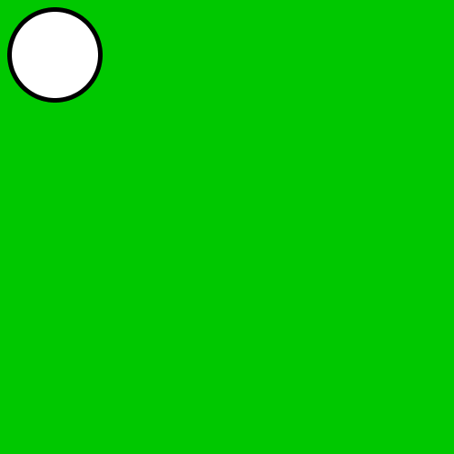
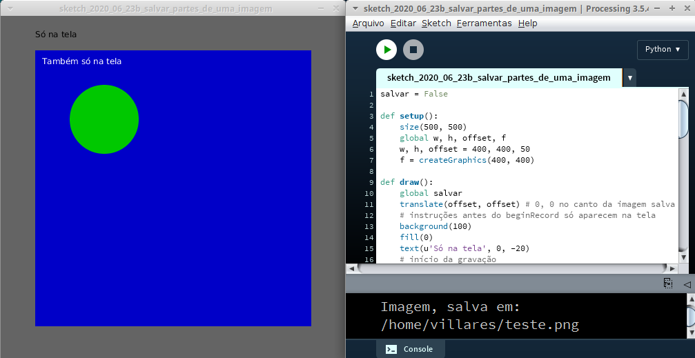

# Como exportar uma imagem

Um *frame* é o resultado visual produzido na área de desenho do *sketch* no Processing em um determinado momento. Para salvar um *frame* em um arquivo bitmap/raster, como por exemplo PNG, TIF ou JPG, usamos a função `saveFrame()`.

Passamos como argumento o nome do arquivo que deve ser salvo, e a extensão de três letras após o ponto no nome do arquivo indica o formato que deve ser salvo. Por exemplo `saveFrame("imagem.jpg")` salva um arquivo JPG na pasta do *sketch*. Se utilizarmos alguns caracteres "#" no nome do arquivo eles serão substituídos pelo número do *frame*. 

O código abaixo exemplifica como salvar uma imagem PNG de um frame. Quando uma tecla é pressionada, é executada a função `keyPressed()` e se for identificada a tecla "s" (`key == 's'`) é execuatada a função saveFrame(), que grava uma imagem na pasta do sketch.

### Um exemplo bem simples

O código abaixo exemplifica como salvar uma imagem PNG de um frame. Quando uma tecla é pressionada, é executada a função `keyPressed()` e se for identificada a tecla "s" (`key == 's'`) é executada a função `saveFrame()`, que grava uma imagem na pasta do *sketch*.

```python
def setup():
    size(500, 500)

def draw():
    background(0, 0, 200)
    x, y = random(width), random(height)
    circle(x, y, 100)

def keyPressed():
    if key == 's':
        saveFrame("frame.png")
        print("PNG salvo")
```
Reulta no aquivo "frame421.png" na pasta do *sketch*:


### `saveFrame()` dentro do `draw()`

Usar `saveFrame()`dentro do laço principal `draw()` torna o *sketch* muito mais lento, pois salva uma imagem a cada *frame* do draw. Acrescentando carateres ``#`` no nome do arquivo a ser salvo,  um número grande de quadros pode ser salvo em alguns segundos, o que deve ser feito com cuidado (pode entupir o disco do seu computador). 

Normalmente é criada uma condição que interrompe o sketch com `exit()` ou que só permite salvar um certo número de imagens (no exemplo abaixo, um quadro a cada 5 com `frameCount % 5 == 0`).

```python
def draw():
    # desenho
    ...
    # salva só a cada 5 frames até o frame 100
    if frameCount % 5 == 0 and frameCount <= 100:
        saveFrame("imagem###.png")
```

Neste outro exemplo, data e horário no nome do arquivo e interrupção do sketch.

```python
nome_output = '{}-{}-{}-{}-{}-{}-frame###.png'.format(year(), month(), day(),
                                                      hour(), minute(), second())
def draw():
    # desenho
    ...
    saveFrame(nome_output)
    if frameCount > 100:
        exit() # interrompe a execução do sketch   
```

### Exportando em resolução maior do que a da tela

Um objeto *PGraphics* é uma espécie de tela virtual que pode gravar o resultado do desenho em paralelo à área de desenho normal, podendo também receber ajustes especiais aplicados apenas a esse objeto-tela, como `.scale()` no exemplo abaixo, o que permite exportar uma imagem 10 vezes maior do que a mostrada na tela. 
```
def setup():
    size(50, 50)
    # preparo da gravação
    scale = 10
    f = createGraphics(width * scale, height * scale)
    beginRecord(f) #  início da gravação
    # ajustes que só afetam o arquivo sendo gravado
    f.scale(scale)
    f.strokeWeight(.5)

    # instruções que afentam a tela e o arquivo
    # sem background após o beginRecord o arquivo fica com fundo transparente!
    background(0, 200, 0)  
    circle(6, 6, 10)
    
    # fim da gravação
    endRecord()
    f.save("exportando_imagem_ampliada.png")
```
Repare que a espessura de linha está sendo ajustada para um valor diferente com `f.strokeWeight()`. Sem o ajuste ela ficaria 10 vezes maior no arquivo do que na área de desenho normal (acompanhando e resto da imagem) e desta maneira ela fica apenas 5 vezes maior no arquivo.



### Exportando apenas parte da tela (e em um local selecionado!)

No exemplo a seguir, vamos usar a estratégia de desenhar em um objeto `PGraphics` como no exemplo anterior, e demonstrar também as seguintes possibilidades:

* Salvar um frame de um skeetch interativo (com `draw()`);

- Salvar apenas parte da imagem na tela (útil para remover elementos de interface/controle);
- Acrescentar ajustes ou elementos apenas na imagem salva;
- Escolher onde salvar a imagem (fora da pasta do sketch).



 Ambos os textos da imagem acima, em preto e em branco, não estarão presentes no arquivo salvo, assim como toda a àrea cinza em volta ou qualquer elemento nela desenhado.

```python
salvar = False

def setup():
    size(500, 500)
    global w, h, offset, f
    # dimensões da imagem e um deslocamento / margem
    w, h, margem = 400, 400, 50
    f = createGraphics(w, h)
    
def draw():   
    global salvar
    translate(margem, margem) # 0, 0 no canto da imagem a ser salva
    # instruções antes do beginRecord só aparecem na tela
    # Se não for criado fundo depois de beginRecord, no arquivo fundo transparente
    background(100)  # fundo geral na tela apenas
    fill(0)
    text(u'Só na tela', 0, -20)
    # início da gravação
    if salvar:
        beginRecord(f) #  início da gravação
    # As instruções aqui aparecem na tela e no arquivo
    noStroke()
    fill(0, 0, 200)
    rect(0, 0, w, h)  # fundo no arquivo usando um retângulo
    fill(0, 200, 0)
    circle(100, 100, 100)
    # fim da gravação
    if salvar:
        # instruções com 'f.' aparecem só na gravação
        f.fill(255, 0, 0)
        f.text(u'Só na gravação', 20, 300)    
        endRecord()
        salvar = False
        # em vez de f.save("arquivo_na_pasta_do_sketch.png")
        # vamos usar esta função selectOtuput que chama por nós salva_arquivo()
        selectOutput("Escolha onde Salvar", "salva_arquivo")
    # instruções depois do endRecord também aparecem só na tela
    fill(255)
    text(u'Também só na tela', 10, 20)

def keyPressed():
    global salvar
    if key == 's':
        salvar = True
        
def salva_arquivo(selection):
    """
    Um alerta: Cuidado! Possíveis 'falhas' nesta função,
    como erros de gravação (por disco cheio, ou falta de
    permissão para gravar em um diretório), mas também
    qualquer outros bugs que você introduzir ampliando
    este código, vão interromper esta linha de execução
    silencionamente, sem mostrar nenhum aviso de erro :(
    """
    if selection is not None:
        # importante usar unicode() em vez de str() aqui!
        nome = unicode(selection)  
        if not nome.lower().endswith('.png'):
            nome += '.png'
        f.save(nome);
        print("Imagem, salva em: " + nome)
    else:
        print("operação de salvar cancelada")
```


Note o texto em vermelho que só aparece no arquivo salvo.


### Assuntos relacionados

- [Desenhando fora da vista com *PGraphics* (*offscreen buffer*)](offscreen-buffer.md)
- [Exportando PDF](exportando_pdf.md)
- [Exportando SVG](exportando_Svg.md)
