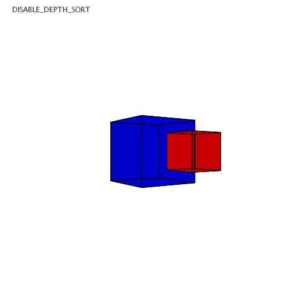

# Exportando SVG

Muito semelhante a exportação de PDF, para salvar um arquivo vetorial SVG, é necessário adicionar uma biblioteca de exportação, que já vem com o Processing, acrescentando esta linha no início do *sketch*:

``` python
add_library('svg')
```
Isso pode ser feito manualmente ou pelo menu *Sketch* do Processing IDE:
***Sketch > Importar Biblioteca > SVG Export***

#### Usando um objeto PGraphics 

A estratégia mostrada a seguir permite mostrar na tela o desenho mas salvar um arquivo ajustes especiais, como por exemplo dimensões escaladas.


```python
"""
Tecle 'e' para salvar um único frame e encerrar o sketch
"""

add_library('svg')

save_frame = False
fator_escala = 3.78 # 255px -> ~255mm

def setup():
    global svg_output
    size(255, 255)
    svg_output = createGraphics(int(width * fator_escala),
                                int(height * fator_escala),
                                SVG, "arquivo.svg")
def draw():
    background(200) # antes do beginRecord() não sairá no SVG
    
    if save_frame:
        beginRecord(svg_output)
        svg_output.strokeWeight(.33)  # linha mais fina ainda!
        svg_output.scale(fator_escala)
        # svg_output.background(200)  # sem background, fundo transparente no SVG
        
    # desenhando aqui, sai na tela e no arquivo
    fill(255, 0, 0, 100)
    rect(50, 50, 100, 100)  
    fill(0, mouseX , mouseY, 100)
    rect(100, 100, 100, 100)  

    if save_frame:
        endRecord()  # encerra a gravação do arquivo
        exit()  # encerra o sketch

def keyPressed():
    global save_frame
    if key == 'e':
        save_frame = True

```

#### Permitindo que a pessoa escolha onde salvar

```python
from java.io import File

add_library('svg')

save_frame = False
fator_escala = 3

def setup():
    size(400, 400)

def draw():
    global save_frame
    if (save_frame):
        beginRecord(output)
        output.scale(fator_escala)    
    
    # Desenho aqui
    background(200, 255, 255)
    rect(100, 100, 100, 100)

    if save_frame:
        endRecord()
        save_frame = False

def salvaSVG(selection):
    global output
    if selection == None:
        println("Salvar cancelado.")
    else:
        println("Salvando em: " + selection.getAbsolutePath())
        output = createGraphics(int(width * fator_escala),
                                int(height * fator_escala),
                                SVG, selection.getAbsolutePath())
        save_frame = True
    
def keyPressed():
    if key == 's':
        sugestao = File("exemplo.svg")
        selectOutput("Salvar:", "salvaSVG", sugestao)
```

### Limitações

O que não funciona quando exportamos em SVG?

- `blendMode(MULTIPLY)`ou qualquer outra variante de `blendMode()` não tem efeito no SVG (só na tela).

#### Exportação de desenho 3D em arquivos vetoriais 2D

É possível exportar a geometria 3D em si para arquivos DXF ou ainda outros formatos apropriados, assunto que não vamos tratar neste momento. 

No exemplo a seguir mostramos como exportar desenhos tridimensionais em formato vetorial 2D, o que pode ser feito tanto em SVG como em PDF, usando `beginRaw()` e `endRaw()`.

O resultado, infelizmente,  é  bastante limitado, como pode ser visto abaixo:

 


```python
"""
Tecle 'e' para salvar um único frame e encerrar o sketch
"""

add_library('svg')
# add_library('pdf')

save_frame = False

def setup():
    global output
    size(500, 500, P3D)  # P3D para denhar em 3D
    output = createGraphics(width, height, SVG, "3D.svg")
    # output = createGraphics(width, height, PDF, "3D.pdf")
    textMode(SHAPE)

def draw():
    if save_frame:
        beginRaw(output)  # com P3D é preciso gravar 'cru'/raw

    background(200)
    fill(0)
    if mousePressed:
        hint(ENABLE_DEPTH_SORT)
        text("ENABLE_DEPTH_SORT", 20, 20)
    else:
        hint(DISABLE_DEPTH_SORT)
        text("DISABLE_DEPTH_SORT", 20, 20)
                     
    # lights()  # não funciona na exportação :(
    translate(250, 250)
    rotateY(frameCount / 100.)
    stroke(0)
    fill(0, 0, 200)
    box(100, 100, 100)  
    translate(0, 0, 100)
    # fill(200, 0, 0, 100)
    fill(200, 0, 0)
    box(50)

    if save_frame:
        endRaw()  # encerra a gravação do arquivo
        exit()  # encerra o sketch

def keyPressed():
    global save_frame
    if key == 'e':
        save_frame = True
```

### Assuntos relacionados:

- [Exportando PDF](exportando_pdf.md)
