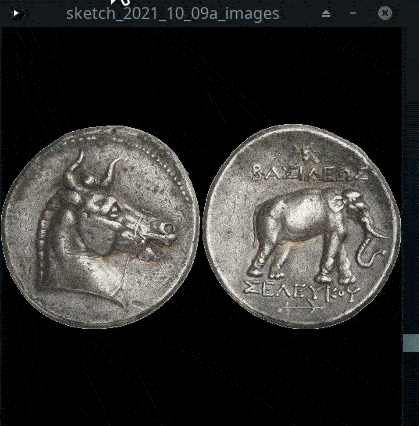

## Lendo todas as imagens da pasta `data`



> Exemplo de execução usando imagens medievais coletadas pelo artista e educador [Daniel Seda](https://www.danielseda.com/home).

Tendo visto previamente como [ler e usar imagens de arquivos externos](imagens_externas.md) com `loadImage()`, e a estrutura de dados lista (`list`) neste exemplo vamos carregar todas as imagens encontradas na pasta `data` localizada dentro da pasta do seu *sketch*. 

É preciso criar uma variável global para guardar as informações dos arquivos encontrados, fazemos isso com a linha contendo `imagens = []` antes do `setup()` que cria uma lista vazia e aponta o nome `imagens` para ela.

Usaremos a função `sketchPath()` do Processing, com o argumento `'data'` para obter o caminho da pasta *data* dentro do seu *sketch*. E vamos também usar funções importadas, trazidas, do módulo `os`do Python para:

- Listar todos os itens de uma pasta com`os.listdir(caminho_da_pasta)`

- Checar se o item é um arquivo (e não uma sub-pasta) com `os.path.isfile(caminho)`

- Juntar um nome de arquivo com o caminho da pasta, formando o "caminho completo" do item, com `os.path.join(caminho, nome_arquivo)`

```python
import os  # para usar listdir, path.isfile, path.join
from random import choice

imagens = []  # lista que vai receber objetos PImage (Processing Image data)

def setup():
    size(400, 400)
    # Ponha as imagens na pasta /data/ dentro da pasta do seu sketch
    data_folder = sketchPath('data')  # encontra o caminho da pasta 'data', não funciona fora do setup
    # Começa olhando para os itens da pasta, confere se é uma imagem e guarda na lista caminhos_arquivos
    caminhos_arquivos = []
    for nome_arquivo in os.listdir(data_folder):
        caminho_arquivo = os.path.join(data_folder, nome_arquivo)
        if os.path.isfile(caminho_arquivo) and has_image_ext(caminho_arquivo):
            caminhos_arquivos.append(caminho_arquivo)
    # Agora efetivamente carrega na memória cada imagem a partir dos caminhos listados no passo anterior
    for caminho_arquivo in caminhos_arquivos:
        img = loadImage(caminho_arquivo)
        imagens.append(img)
    # Vamos congelar a repetição do draw(), clique com o mouse para uma nova imagem (redraw)
    noLoop()  
        
def draw():
    background(0)
    random_image = choice(imagens)
    fator_escala = 1
    if random_image.width > width:
        fator_escala = float(width) / random_image.width
    if random_image.height * f > height:
        fator_escala = float(height) / random_image.height
    imageMode(CENTER)
    image(random_image, width / 2, height / 2,
          random_image.width * fator_escala, random_image.height * fator_escala
                     
def mouseClicked():  # executa quando o mouse é clicado
    redraw()
    
def has_image_ext(file_name):
    # tupla com extensões válidas para imagens
    valid_ext = ('jpg', 'png', 'jpeg', 'gif', 'tif', 'tga')
    file_ext = file_name.split('.')[-1]
    return file_ext.lower() in valid_ext
```

## Assuntos relacionados

- Estrutura de pixels das imagens em [Pixels e imagens](pixels.md)
- [Lendo e escrevendo texto em arquivos (*file IO*)](/Processing-Python/file_IO.md)
- [Lendo todas as imagens de uma pasta selecionada pela pessoa usuária](imagens_externas_pasta.md)
