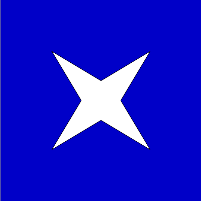

## O que é indentação?

A palavra *indentação* também significa  'recuo',  veja este exemplo de uma lista de compras relativamente organizada:

```
comes:
    pão
    cebola
    abacate
    alho
    
bebes:
    chá mate
    sucos:
        maçã
        uva
        laranja
    refrigerantes:
        água tônica
```
O espaço que faz os itens ficarem 'dentro' das categorias é a *indentação*, e é exatamente da mesma maneira que em Python criamos blocos de código que estão 'dentro'  de uma estrutura ou de outros blocos. Note também o `:` antes do bloco indentado na lista de compras.

Essa sintaxe com o espaço de indentação, e `: ` , vai ser usada em inúmeras estruturas de Python, como `if`/`else`,  no laço de repetição `for`,  na definição de novas funções com `def`, entre outras.

### Animando uma estrela com o movimento do mouse

Vamos ver agora um exemplo que precisa de indentação, avançando um pouco em ideias cujos detalhes você pode retomar depois na página sobre [movimento](movimento_py.md).

#### A função `setup()` e a função `draw()`

Podemos reorganizar o código anterior mostrado no [primeiro contato com polígonos](poligonos_1.md) colocando os ajustes iniciais (*setup*), como  `size(200,200)`, dentro da definição de função `def setup():`, e a parte que desenha (*draw*) dentro de `def draw():`.

A função `setup()` vai ser executada apenas uma vez no começo, e a função `draw()` fica repetindo sem parar, permitindo o movimento. Repare como a indentação é o que determina  o que está dentro de cada função.

```python
def setup():
    size(400, 400)

def draw():
    background(0, 0, 200)  # para limpar a área de desenho
    
    x, y = width / 2, height / 2  # coordenadas do centro
    mm, m = mouseY / 4, mouseY / 4

    beginShape()
    vertex(x - mm, y - mm)
    vertex(x - m, y)
    vertex(x - mm, y + mm)
    vertex(x, y + m)
    vertex(x + mm, y + mm)
    vertex(x + m, y) 
    vertex(x + mm, y - mm)
    vertex(x, y - m)
    endShape(CLOSE)
```

<div id="iframeDiv"></div>
    
<a id="iframeLink" href="https://abav.lugaralgum.com/material-aulas/Processing-Python/assets/indentacao/" >Veja o resultado aqui</a>

### Assuntos relacionados

- Mais sobre [animações com `setup()` e `draw()`](movimento_py.md)
- Estrelas de muitas pontas com [laços de repetição `while`](https://github.com/villares/material-aulas/blob/master/Processing-Python/while.md)
- Você pode ver usos mais avançados de `beginShape()` na [referência](https://py.processing.org/reference/beginShape.html).
- Você pode montar os vértices a partir de [estruturas de dados com laços de repetição ou fazer polígonos com furos](https://github.com/villares/material-aulas/blob/master/Processing-Python/poligonos_2.md)
