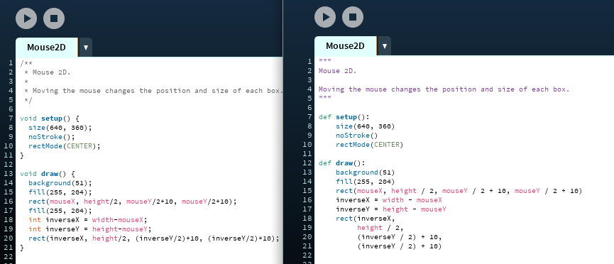

## Dicas para portar código de Processing modo Java para modo Python

> …e possivelmente vice-versa :)

 

### Considerações gerais

- Como você provavelmente sabe, em Python o que conta para saber se uma linha de código está 'dentro' de uma função ou de outra estrutura qualquer, como um `if`, é a indentação. No Java são as chaves `{}` que mandam, mas é comum a indentação refletir a hierarquia, mesmo isso não sendo obrigatório. Por isso, use a ferramenta de auto-formatação do IDE antes de começar e avance com cuidado! 
- As chaves precisam ser removidas, e você deve trocar cada `{ ` por `:` no começo de um bloco de instruções (isso só não vale para as definições de *arrays*, que tem chaves mas não definem um bloco de instruções, e viram uma lista ou uma tupla com `[ ]` ou` ( )` ). 
- Remova os `;` no final das linhas.
- Comentários com `//` no Java viram comentários com `#`. Comentários de várias linhas com `/* … */ ` podem virar *docstrings*, com aspas triplas no Python, `""" … """`.
- Java é uma linguagem de *tipagem estática* e Python é uma linguagem de *tipagem dinâmica*  isso significa que vamos remover todas as declarações de tipo. Remova `int `, `float`, `String`, `color` , `boolean`  das declarações de variáveis. Por exemplo,  `int i = 0; ` se torna `i = 0`.
- Podemos também remover `void` ou  tipo na declaração de uma função e colocar no lugar o `def` do Python.  Depois remover a declaração de tipo dos parâmetros da função.

   **Java**
  
  ```java
  float media(float a, float b){
    return (a + b) / 2;
  }
  ```
  **Python**
  
  ```python
  def media(a, b):
      return (a + b) / 2
  ```

### Um quadro com equivalências para conversão

Os valores booleanos em Java são `true` e `false`, o que em Python fica `True` e `False`.  Vamos fazer um quadro com os operadores lógicos e algumas outras equivalências. 

| Java                                             | Python                                     |
| ------------------------------------------------ | ------------------------------------------ |
| `void func() { … }`                              | `def func(): …`                            |
| **`true`** e **`false`**                         | **`True`** e **`False`**                   |
|  <code>a <b>&&</b> b</code> (E lógico)                    | `a `**`and`**` b`                                  |
| <code>a <b>&#x7C;&#x7C;</b> b</code> (OU lógico) | `a `**`or`**` b`                                   |
| **`!`**`a` (NÃO lógico)                      | **`not`**` a`                                    |
| `i++` (incremento)                               | `i += 1`                                   |
| `i--`(decremento)                                | `i -= 1`                                   |
| `a <= b && b < c`                                | `a <= b < c`                               |
| `for (int i=0; i < limite; i++){ … `             | `for i in range(limite): …`                |
| `for (int i=inicio; i < limite; i += passo){ … ` | `for i in range(inicio, limite, passo): …` |
| `for (Bola b : arrayListBolas){ …`               | `for b in listaBolas: …`                   |
| `for (Bola b : arrayListBolas){ …`               | `for b in listaBolas: …`                   |
| `fill(#FFCC00) // notação hexadecimal de cores`  | `fill('#FFCC00') # precisa ' ' ou " "` (não funciona com `color()`) |

E semelhante a `null` de Java temos o valor `None` em Python os usos não são totalmente equivalentes mas é um bom palpite fazer a substituição.

### Loops `for`

O caso mais simples é um `for` baseado em um contador qualquer, como `for (int i=0; i < limite; i++){ … ` cuja tradução é `for i in range(limite): …` e o chamado *for each*, mostrado no quadro, também é muito direto. 

Mas se você encontrar um loop `for` no Java com um passo não inteiro (*float*), como a construção baseada em `range()` no  Python só funciona com números inteiros, você vai ter que convertê-lo em um loop `while` como no exemplo abaixo.

**Java**

```java
float passo = TWO_PI / 18
for (float angulo=0; angulo < TWO_PI; angulo += passo){ 
    …
}
```

**Python**

```python
passo = TWO_PI / 18
angulo = 0
while angulo < TWO_PI:
    …
    angulo += passo
```

Aqui um exemplo de laço é feito apenas para pegar objetos de uma estrutura de dados:


```java
for (int i = 0;  i < meu_array.length; i++) {
  fazendoAlgo(i, meu_array[i]);
}
```

**Python**

```python
for item in minha_lista:
    fazendoAlgo(item)
```
ou
```python
for i, item in enumerate(minha_lista):
    fazendoAlgo(i, item)
```

Veja uma iteração invertida para remover itens de um *ArrayList* no Java, uma lista no Python:

**Java**

```java
for (int i = particles.size()-1; i >= 0; i--) {
  Particle p = particles.get(i);
  p.run();
  if (p.isDead()) {
    particles.remove(i);
  }
}
```

**Python**

```python
for p in reversed(particles):
    p.run()
    if p.isDead():
        del p
```

ou, se você precisar o índice:

```python
for i in reversed(range(len(particles))):
    p = particles[i]
    p.run()
    if p.isDead():
        del particles[i]
```

ou ainda:

```python
for i, p in reversed(list(enumerate(self.particles))):
    p.run()
    if p.isDead():
        del p # ou del self.particles[i]
```


### `if`, `else` e seus amigos

Note que a condição do `if` no Python não tem os parênteses obrigatórios no Java. A combinação de um `else if` vira a contração `elif`.

**Java**

```java
for (int i = 2; i < width-2; i += 2) {
  if ((i % 20) == 0) {
    stroke(255);
    line(i, 80, i, height/2);
  } else if ((i % 10) == 0) {
    stroke(153);
    line(i, 20, i, 180); 
  } else {  
    stroke(102);
    line(i, height/2, i, height-20);
  }
}
```
**Python**

```python
for i in range(2, width - 2, 2):
    # If 'i' divides by 20 with no remainder
    if i % 20 == 0:
        stroke(255)
        line(i, 80, i, height / 2)
    elif i % 10 == 0:
        stroke(153)
        line(i, 20, i, 180)
    else:
        stroke(102)
        line(i, height / 2, i, height - 20)
```

#### Operador ternário

**Java**

```java
resultado = cond ? a : b 
```
**Python**

```python
 resultado = a if cond else  b 
```

#### switch & case

Não existe `switch/case` no Python, você pode trocar por uma cadeia de `if/elif` ou, se for só para chamar diferentes funções, um dicionário de funções [TO DO página sobre isso].

### Variáveis globais

Se a variável for *declarada e inicializada* (definido o tipo e o valor) no começo do *sketch* basta remover a declaração de tipo.

Mas como não há em Python a declaração de uma variável sem fazer uma atribuição, quando a variável é só declarada (é indicado um tipo sem a *inicialização*, isto é ter sua primeira atribuição) no começo do *sketch* precisamos ver onde ela é calculada a primeira vez e acrescentar, no início da função, a instrução `global nome_da variável`. 

Na verdade, toda função que altera a atribuição de variáveis globais em seu corpo precisa da instrução `global` com os nomes das variáveis que são modificadas. 

Veja um exemplo:

**Java**
```java

int rad = 60;        // Width of the shape
float xpos, ypos;    // Starting position of shape    
float xspeed = 2.8;  // Speed of the shape
float yspeed = 2.2;  // Speed of the shape
int xdirection = 1;  // Left or Right
int ydirection = 1;  // Top to Bottom

void setup() 
{
  size(600, 300);
  // Set the starting position of the shape
  xpos = width/2;
  ypos = height/2;
}

void draw() 
{
  background(102);
  xpos = xpos + ( xspeed * xdirection );
  ypos = ypos + ( yspeed * ydirection );
    
  if (xpos > width-rad || xpos < rad) {
    xdirection *= -1;
  }
  if (ypos > height-rad || ypos < rad) {
    ydirection *= -1;
  }

  ellipse(xpos, ypos, rad * 2, rad * 2);
}
```
**Python**

```python

rad = 60;        # Width of the shape
# No original tinha: float xpos, ypos; // Starting position of shape    
xspeed = 2.8;    # Speed of the shape
yspeed = 2.2;    # Speed of the shape
xdirection = 1;  # Left or Right
ydirection = 1;  # Top to Bottom

def setup():**Python**
    size(600, 300)
    global xpos, ypos  #  xpos, ypos são globais criadas no setup
    noStroke()
    xpos = width / 2
    ypos = height / 2

def draw():
    global xpos, ypos, xdirection, ydirection  # vão ser alteradas!
    background(102)   
    xpos += xspeed * xdirection
    ypos += yspeed * ydirection
    
    if xpos < rad or width - rad < xpos:  # note que rad não é alterada
        xdirection *= -1
    if ypos < rad or height - rad < ypos:
        ydirection *= -1
    ellipse(xpos, ypos, rad * 2, rad * 2)
```
### Importando bibliotecas e as outras abas do sketch

No Processing modo Java as bibliotecas são importadas com `import` mas no modo Python essa instrução é mais usada para importar *módulos* da biblioteca padrão do Python, e arquivos **.py** das outras abas do IDE, que ao contrário do modo Java não são automaticamente parte do *sketch*.

```python
from outra_aba import *  # aba no arquivo outra_aba.py
```

Para bibliotecas de terceiros, use o comando do menu **Sketch > Importar Biblioteca...** (ou *Sketch > Import Library...* em inglês) para acrescentar a linha com  `add_library()` e o argumento correto.

**Java**

```java
import com.hamoid.*; // importa biblioteca VideoExport no modo Java
```

**Python**

```python
add_library('VideoExport')  # a mesma biblioteca no modo Python
```

### Orientação a objetos

#### Obtendo uma instância e acessando métodos e atributos

Java precisa da palavra chave **`new`** para criar uma instância de uma classe, é só removê-la! O acesso a métodos e atributos é exatamente igual.

**Java**

```java
VideoExport videoExport;

void setup() {
  size(600, 600);
  videoExport = new VideoExport(this);
  videoExport.startMovie();
}
```

**Python**

```python
def  setup() :
    global videoExport
    size(600, 600)
    videoExport = VideoExport(this)
    videoExport.startMovie()
```

#### Declarando uma classe

Já as declarações de classe mudam um pouco, grosso modo, o método `__init__()` faz o papel do *construtor* da classe.  Veja a classe `MRect` do exemplo **Basics > Objects > Objects** que vem no IDE do Processing. Você vai ter o trabalho de acrescentar `self` como primeiro parâmetro de todos os métodos, e vai ter que usar `self.` para acessar atributos e membros da classe. Veja um exemplo:

**Java**

```java
class MRect 
{
  int w; // single bar width
  float xpos; // rect xposition
  float h; // rect height
  float ypos ; // rect yposition
  float d; // single bar distance
  float t; // number of bars
 
  MRect(int iw, float ixp, float ih, float iyp, float id, float it) {
    w = iw;
    xpos = ixp;
    h = ih;
    ypos = iyp;
    d = id;
    t = it;
  }
 
  void move (float posX, float posY, float damping) {
    float dif = ypos - posY;
    if (abs(dif) > 1) {
      ypos -= dif/damping;
    }
    dif = xpos - posX;
    if (abs(dif) > 1) {
      xpos -= dif/damping;
    }
  }
 
  void display() {
    for (int i=0; i<t; i++) {
      rect(xpos+(i*(d+w)), ypos, w, height*h);
    }
  }
}
```

**Python**

```python
class MRect:

    def __init__(self, iw, ixp, ih, iyp, id, it):
        self.w = iw  # single bar width
        self.xpos = ixp  # rect xposition
        self.h = ih  # rect height
        self.ypos = iyp  # rect yposition
        self.d = id  # single bar distance
        self.t = it  # number of bars

    def move(self, posX, posY, damping):
        self.dif = self.ypos - posY
        if abs(self.dif) > 1:
            self.ypos -= self.dif / damping

        self.dif = self.xpos - posX
        if abs(self.dif) > 1:
            self.xpos -= self.dif / damping

    def display(self):
        for i in range(self.t):
            rect(self.xpos + (i * (self.d + self.w)),
                 self.ypos, self.w, height * self.h)
```

### Estruturas de dados

Arrays como `int[]`, `float[]` ou `PVector[]` podem virar listas em Python (ou quem sabe tuplas, se forem criadas e deixadas quietas). Um *ArrayList* é muito parecido com uma lista:

**Java**
```java
ArrayList<Bandeirinha> Bandeirinhas; // uma lista de objetos da classe Bandeirinha

void setup() {
  size(400, 400); 
  Bandeirinhas = new ArrayList<Bandeirinha>();
  for (int i=0; i <50; i++) {
    Bandeirinhas.add(new Bandeirinha(100, 100, 12));
  }
}
```

**Python**
```python
Bandeirinhas = []  # uma lista de objetos Bandeirinha

def setup():
    size(400, 400); 
    for i in range(50):
        Bandeirinhas.append(Bandeirinha(100, 100, 12))
```

#### Arrays 2D 

```java
int[][] board;
board = new int[grid_w][grid_h]
```
Faça uma lista de listas (não, você não pode usar numpy):

```python
board = [[0] * grid_w for _ in range(grid_h)]
```

---

Trabalho em andamento...
