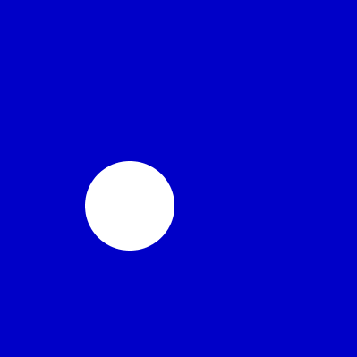

# Movimento

## A estrutura `setup()` e `draw()`

Para produzir movimento nos valemos de uma ideia presente em todo tipo de animação, a ideia dos *quadros* (*frames*) que são as imagens mostradas em uma rápida sucessão. No Processing a geração dessas imagens acontece dentro de uma função que devemos definir chamada `draw()`. Tudo que é desenhado dentro de `draw()` é na verdade redesenhado cerca de 60 vezes por segundo (o chamado *frame rate*). Para se obter o efeito de uma animação de elementos se deslocando na tela devemos "limpar" o quadro no começo de cada `draw()` frequentemente com a instrução `background()`. Se desenharmos sem essa "limpeza" da tela os elementos "acumulam" ou "deixam um rastro".

Antes do *laço principal de repetição*, que é como costumamos descrever a execução do `draw()`, é executada uma função de preparo ou configuração chamada `setup()` que também precisamos definir. Essas duas funções juntas são a forma mais comum de se estruturar um *sketch* (um programa em Processing).

Resumindo: Dentro do `setup()` vai tudo aquilo que precisamos fazer apenas uma vez e no começo, como, por exemplo, definir a àrea de desenho com `size()`. Já no `draw()` vão principalmente as instruções de desenho propriamente dito, em geral precedidas por uma limpeza da tela ou fundo, e são acionados os cálculos de atualização dos elementos da animação.

Note que no exemplo a seguir, a posição e velocidade do círculo é mantida em algumas variáveis, `px`, `py`, `vx` e `vy`, que precisam ser 'lembradas' entre os ciclos de repetição do `draw()` e dentro dele são modificadas. Isso é o que chamamamos de *variáveis globais*, em contraste com variáveis que fossem criadas dentro do `draw()` e que seriam *variáveis locais*. Leia mais sobre isso na página [Escopo: variáveis globais e locais](escopo_py.md). 

## Círculo rebatendo nas bordas



```python
raio = 50  # tamanho do raio do círculo
vx = 2.5   # velocidade horizontal inicial
vy = -1.5  # velocidade vertical inicial

def setup():
    global px, py
    size(400, 400)
    # Define a posição inicial do círculo
    px, py = width / 2, height / 2

def draw():
    global px, py, vx, vy
    background(0, 0, 200) # limpa o frame com um fundo azul
    # Atualiza as variáveis da posição do círculo
    px = px + vx
    py = py + vy
    # Testa se o círculo está fora da tela, se estiver,
    # inverte a velocidade (que se torna -velocidade).
    if px > width - raio or px < raio:
        vx = -vx
    if py > height - raio or py < raio:
        vy = -vy
    # Desenha o círculo
    noStroke()  # sem traço de contorno
    ellipse(px, py, raio * 2 , raio * 2)
    # em versões mais novas do Processing
    # podemos usar circle(px, py, raio * 2)
```
### Assuntos relacionados

- [Escopo: variáveis globais e locais](escopo_py.md)
- [Como exportar animações](exportar_animacoes.md)

---
Este material é baseado no material do curso https://arteprog.space/programacao-criativa/

---
Texto e imagens / text and images: CC BY-NC-SA 4.0; Código / code: GNU GPL v3.0 exceto onde explicitamente indicado por questões de compatibilidade.
