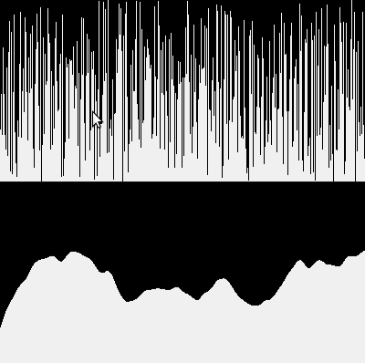
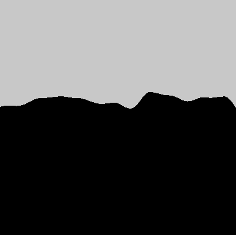
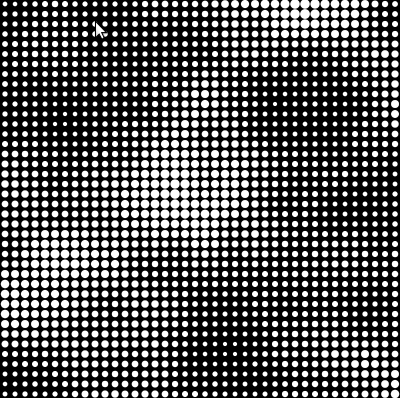

## *Perlin noise*
#### Ruído de Perlin

><i>An algorithm known as “Perlin noise,” named for its inventor Ken Perlin, takes this concept into account. Perlin developed the noise function while working on the original Tron movie in the early 1980s; it was designed to create procedural textures for computer-generated effects. In 1997 Perlin won an Academy Award in technical achievement for this work. Perlin noise can be used to generate various effects with natural qualities, such as clouds, landscapes, and patterned textures like marble.
>
>Perlin noise has a more organic appearance because it produces a naturally ordered (“smooth”) sequence of pseudo-random numbers. The graph on the left below shows Perlin noise over time, with the x-axis representing time; note the smoothness of the curve.</i> SHIFFMAN, Daniel,[*The Nature of Code*](https://natureofcode.com/book/introduction/), 2012.

### Noise 1D

O primeiro exemplo, usando a função que gera um número entre **0** e **1** chamada `noise()` com apenas um argumento, e comparando o resultado com `random(1)` (na parte de cima).

Note que os valores produzidos tem relação com os vizinhos (ao contrário do `random()`)  produzindo uma curva relativamente suave. Podemos experimentar mudar a `escala` que multiplica os passos dados no argumento de entrada, o X, ou ainda deslocar esse X. A amplitude é ajustada mudando o valor pelo qual multiplicamos o resultado de `noise()` ou usando `lerp()`.

```python
escala = 0.01
desloca_x = 0

def setup():
    size(400, 400)   

def draw():   
    background(100)  
    randomSeed(1001) 
    for x in range(width):
        y = random(height/2)
        line(x, 0, x, y)
        
    for x in range(width):
        n = noise((desloca_x + x) * escala)
        y = lerp(height / 2, height, n)
        # y = height / 2 + (height / 2) * n
        line(x, height / 2, x, y)
        
def keyPressed():
    global escala, desloca_x
    if key == 'a':
        escala += 0.001
    if key == 'z':
        escala -= 0.001         
    if key == 's':
        desloca_x += 5
    if key == 'x':
        desloca_x -= 5 
```



### Noise 2D, acrescentando um Y

Acrescentando uma segunda dimensão, um Y que serve de segundo argumento na função `noise()`. Ambos são multiplicados pela escala, e no exemplo abaixo, deslocados pela posição do mouse.

```python
        
Com a segunda dimensão perpendicular à primeira, é como se estivéssemos movendo o corte de um terreno em uma direção perpendicular ao corte.
```python
escala = 0.004

def setup():
    size(400, 400)
    
def draw():
    background(200)
    for x in range(width):
        n = noise((mouseX + x) * escala,
                  mouseY * escala)
        y = height * n
        line(x, height, x, height - y)
```



#### Noise 2D em uma grade

Uma segunda maneira de usar o ruído de Perlin é distribuindo os valores em uma grade, usando as coordenadas como passos em X e Y.

```python
escala = 0.01
desloca_x = 100
desloca_y = 100
tam = 10

def setup():
    size(400, 400)   
    noStroke()
    
def draw():   
    background(0)          
    for x in range(0, width, tam):
        for y in range(0, height, tam):
            n = noise((desloca_x + x) * escala,
                      (desloca_y + y) * escala)
            ellipse(tam / 2 + x,
                    tam / 2 + y,
                    2 + tam * n,
                    2 + tam * n)
        
def keyPressed():
    global escala, desloca_x, desloca_y
    if key == 'a':
        escala += 0.001
    if key == 'z':
        escala -= 0.001         
    if keyCode == LEFT:
        desloca_x += 5
    if keyCode == RIGHT:
        desloca_x -= 5         
    if keyCode == UP:
        desloca_y += 5
    if keyCode == DOWN:
        desloca_y -= 5   
```


### Noise 3D, acrescentando um Z

Exemplo de Perlin Noise com três dimensões. O mouse desloca o campo em X e Y, as setas para cima e para baixo deslocam em Z.

```python
escala_noise = 0.1
z = 0

def setup():
    size(400, 400)
    noStroke()
    colorMode(HSB)

def draw():
    background(0)
    cols = 50
    tam = width / cols
    for x in range(cols):
        for y in range(cols):
            n = noise((mouseX + x) * escala_noise, (mouseY + y) * escala_noise, z * escala_noise)
            fill(240 * n, 255, 255)
            ellipse(tam / 2 + x * tam, tam / 2 + y * tam,
                    tam - tam * n, tam - tam * n)
            
def keyPressed():
    global z
    if keyCode == UP:
        z +=1
    if keyCode == DOWN:
        z -=1
```


##### Campo "vetorial" de ruído

Um campo em que o valor do ruído Perlin gira um ângulo.

```python
escala = 0.003
z = 0 
def setup():
    size(400, 400)
    stroke(255)
    
def draw():
    background(0)
    for x in range(0, width, 10):
        for y in range(0, height, 10):
            n = noise((mouseX + x) * escala,
                     (mouseY + y) * escala,
                     z * escala)
            pushMatrix()
            translate(x, y)
            rotate(TWO_PI * n)
            line(-5, 0, 5, 0)
            popMatrix()
        
def keyPressed():
    global z
    if keyCode == UP:
        z +=1
    if keyCode == DOWN:
        z -=1
```

