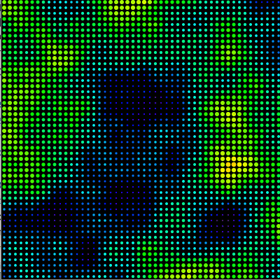

## *Perlin noise*
#### Ruído de Perlin

><i>An algorithm known as “Perlin noise,” named for its inventor Ken Perlin, takes this concept into account. Perlin developed the noise function while working on the original Tron movie in the early 1980s; it was designed to create procedural textures for computer-generated effects. In 1997 Perlin won an Academy Award in technical achievement for this work. Perlin noise can be used to generate various effects with natural qualities, such as clouds, landscapes, and patterned textures like marble.
>
>Perlin noise has a more organic appearance because it produces a naturally ordered (“smooth”) sequence of pseudo-random numbers. The graph on the left below shows Perlin noise over time, with the x-axis representing time; note the smoothness of the curve.</i> SHIFFMAN, Daniel,[*The Nature of Code*](https://natureofcode.com/book/introduction/), 2012.

```python
def setup():
    size(600, 400)
    # noLoop()
    
def draw():
    background(200)
    for x in range(width):
        # y = random(height)
        escala = 0.004
        print("escala:{}".format(escala))
        n = noise((mouseX + x) * escala)
        y = height * n
        line(x, height, x, height - y)
        
```

### Noise 2D

```python
        
### Acrescentando um Y

Com a segunda dimensão perpendicular à primeira, é como se estivéssemos movendo o corte de um terreno em uma direção perpendicular ao corte.
```python
escala = 0.004

def draw():
    background(200)
    for x in range(width):
        n = noise((mouseX + x) * escala,
                  mouseY * escala)
        y = height * n
        line(x, height, x, height - y)
```
#### Noise 2D em uma grade


### Noise 3D

Exemplo de Perlin Noise com três dimensões. O mouse desloca o campo em X e Y, as setas para cima e para baixo deslocam em Z.

```python
escala_noise = 0.1
z = 0

def setup():
    size(400, 400)
    noStroke()
    colorMode(HSB)

def draw():
    background(0)
    cols = 50
    tam = width / cols
    for x in range(cols):
        for y in range(cols):
            n = noise((mouseX + x) * escala_noise, (mouseY + y) * escala_noise, z * escala_noise)
            fill(240 * n, 255, 255)
            ellipse(tam / 2 + x * tam, tam / 2 + y * tam,
                    tam - tam * n, tam - tam * n)
            
def keyPressed():
    global z
    if keyCode == UP:
        z +=1
    if keyCode == DOWN:
        z -=1
```



##### Campo de ruído

Um campo em que o valor do ruído Perlin gira um ângulo.

```python
escala = 0.003
z = 0 
def setup():
    size(400, 400)
    stroke(255)
    
def draw():
    background(0)
    for x in range(0, width, 10):
        for y in range(0, height, 10):
            n = noise((mouseX + x) * escala,
                     (mouseY + y) * escala,
                     z * escala)
            pushMatrix()
            translate(x, y)
            rotate(TWO_PI * n)
            line(-5, 0, 5, 0)
            popMatrix()
        
def keyPressed():
    global z
    if keyCode == UP:
        z +=1
    if keyCode == DOWN:
        z -=1
```

