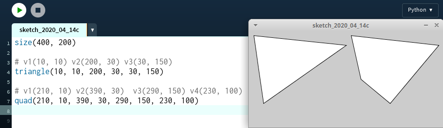

# Desenhando polígonos

Processing oferece funções para desenhar triângulos `triangle()`) e quadriláteros `quad()`, 3 e 4 pares de números, coordenadas para 3 e 4 vértices, respectivamente, como no exemplo a seguir:



Mas e se quisermos desenhar um polígono com um número arbitrário de vértices?

Neste caso usaremos um conjuto de funções, começando com `beguinShape()`, seguido de um número de vezes da função `vertex()` para cada vértice, terminando com `endShape()`.


### Desenhando uma estrela de quatro pontas


```pyde
def setup():
    size(200, 200)
    x, y = 100, 100  # coordenadas do centro
    largura_total, largura_menor = 150, 100
    mm, m = largura_total / 2, largura_menor / 2
    beginShape()
    vertex(x - mm, y - mm)
    vertex(x - m, y)
    vertex(x - mm, y + mm)
    vertex(x, y + m)
    vertex(x + mm, y + mm)
    vertex(x + m, y)
    vertex(x + mm, y - mm)
    vertex(x, y - m)
    endShape(CLOSE)
```
