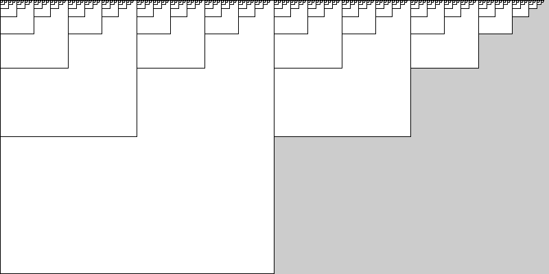

# Recursão

Allen Downey [no livro Pense em Python 2e](https://penseallen.github.io/PensePython2e/05-cond-recur.html#termo:recursividade) definie *recursividade* como o processo de chamar uma função que está sendo atualmente executada.

A ideia central de recursão é de que uma função pode chamar outras funções, e no caso de uma função recursiva, a função pode também chamar ela mesma!

Para que isso funcione (e não caia em uma cilada conhecida como "recursão infinita") é preciso que a função em certas condições chegue em uma opção de execução que não requer chamar ela mesma, é o chamado "caso base".

### Um primeiro exemplo



```python
def setup():
    size(800, 400)
    background(255)
    desenha_retangulos(0, 0, 399, 10)
    saveFrame("recursividade.png")

def desenha_retangulos(x, y, tamamho, nivel):
    fill(nivel * 24)
    rect(x, y, tamamho, tamamho)
    if nivel > 1:
        desenha_retangulos(x, y, tamamho / 2, nivel - 1)
        desenha_retangulos(x + tamamho, y, tamamho / 2, nivel - 1)
    # o caso base aqui é quando nível (`nivel') chega a 1 (nivel > 1 se torna falso)
    # e então apenas o retângulo no início da função é desenhado.
```

### Árvore recursiva

```python
def setup():
    size(500, 500)
 
def draw():
    background(240, 240, 200)
    translate(250, 300)
    galho(60)
    
def galho(tamanho):
    ang = radians(mouseX)
    encurtar = .8
    line(0, 0, 0, -tamanho)  
    if tamanho > 5:
        translate(0, -tamanho)
        rotate(ang)
        galho(tamanho * encurtar)  
        rotate(2 * -ang)
        galho(tamanho * encurtar) 
        rotate(ang)
        translate(0, tamanho)
```

[exemplo interativo com pyp5js](https://abav.lugaralgum.com/sketch-a-day/2019/sketch_191025pybr2019/index.html)

<iframe src="https://abav.lugaralgum.com/sketch-a-day/2019/sketch_191025pybr2019/index.html" width=500 height=500></iframe>


### Uma grade recursiva

```python
def setup():
    size(400, 400)
    background(0)
    noFill()
    stroke(255)
    grade(0, 0, width - 1, 4)
    

def grade(xg, yg, wg, n=None):
    n = n or int(random(1, 5))  # n if n is not None else int(random(1, 5))
    w = wg / float(n)
    for i in range(n):
        x = xg + i * w
        for j in range(n):
            y = yg + j * w
            if n == 1:
                rect(x, y, w, w)
            else:
                if w < 20:
                    ellipse(w/2+x, w/2+y, w, w)
                else:
                    grade(x, y, w)
```


---
Este material é baseado no material do curso https://arteprog.space/programacao-criativa/

---
Texto e imagens / text and images: CC BY-NC-SA 4.0; Código / code: GNU GPL v3.0 exceto onde explicitamente indicado por questões de compatibilidade.

