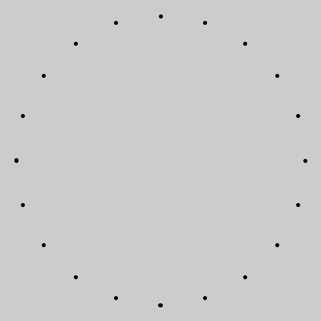
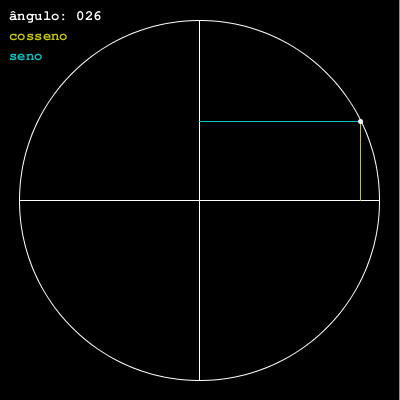

## Um pouco de ângulos, com seno, cosseno e arco tangente

### `sin()`, `cos()` e `atan2()`

As funções trigonométricas não são nenhum bicho de sete cabeças, 2π cabeças, no máximo...

Para começar é preciso saber que quando elas pedem um ângulo como argumento. elas esperam que você informe esse ângulo em *radianos*, se você pensa em graus, é só usar `radians(angulo_em_graus)` para converter. Algumas como `atan2()` devolvem um ângulo em radianos, que pode ser convertido em graus com `degrees(angulo_em_radianos)`se você precisar.

### Seno e cosseno

Para além da origem dessas funções nas relações matemáticas dos ângulos de um triângulo e de um círculo de raio unitário, das coisas mais úteis que você pode entender facilmente é que essas funções devolvem valores entre **-1** e **1** de maneira cíclica, periódica.

Vamos visualizar aqui em alguns exemplos o que isso significa.

#### `sin()` e `cos()` no espaço


Para produzir a imagem acima, criamos um laço repetição que produz um `x` de **0** a **720** , convertido esse `x`num ângulo em radianos e dividido por **2** , temos ângulos de **0** a **2π** (ou **0** a **360°**). 

Vamos  multiplicar o valor do seno e do cosseno do ângulo pela metade da altura da tela (aproveitando para inverter o sinal pois o Y do Processing cresce para baixo e estamos acostumados a ver os gráficos com a parte positiva para cima) . Para deslocar a origem para baixo somamos esse mesmo valor de metade da altura da tela.

```python
def setup():
    size(720, 229)  # 360×2, 4 radianos
    for x in range(width):
        meia_altura = height / 2  
        ang = radians(x / 2.0)  # 720 -> 360
        seno = sin(ang) * -meia_altura + meia_altura        
        point(x, seno)
        cosseno = cos(ang) * -meia_altura + meia_altura
        point(x, cosseno)
```

Qual é o seno e qual o cosseno?

```python
print(sin(0))  # exibe no console: 0.0
print(cos(0))  # exibe no console: 1.0
```

O seno é o que começa à esquerda no **0**, na meia altura da tela, e o cosseno é o que começa no alto valendo **1**.

##### Outra versão com algumas indicações

Desta vez o exemplo usa `translate()` e `scale()` para deslocar e inverter o eixo Y. E o X vai de **0** a aproximadamente **2π** mutiplicado por **100**


```python
def setup():
    size(628, 200)  # malandrangem 2π×100, 2×100 
    textFont(createFont('FreeMono Bold', 14))
    background(0)
    translate(0, 100) # desloca o Y meia tela
    indicacoes()  # desenha textos e linha em π
    
    strokeWeight(2)
    scale(1, -1)  # inverte o Y
    for x in range(width):
        a = x / 100.0  # width ~2π×100
        y_cosseno = cos(a) * 100
        stroke(200, 200, 0)
        point(x, y_cosseno)
        y_seno = sin(a) * 100
        stroke(0, 200, 200)
        point(x, y_seno)

def indicacoes():
    fill(255)
    text(" 0", 0, 5)
    text("-1", 0, 98)
    text(" 1", 0, -90)
    stroke(255)
    strokeWeight(1)
    line(width / 2.0, -height / 2.0,
         width / 2.0, height / 2.0)
    text(u"π 180°", -14 + width / 2.0,
         10 - height / 2.0)
    fill(200, 200, 0)
    text("cosseno", 10, -70)
    fill(0, 200, 200)
    text("seno", 10, -50)
```

#### `sin()` e `cos()` no tempo

Seno e cosseno são muito úteis para fazer animações cíclicas, é muito fácil usar a contagem pronta dos quadros oferecida pelo Processing,  `frameCount` como se fosse um ângulo em graus, converta em radianos e *voi-lá*!


```python
def setup():
    size(628, 200)  # malandrangem 2π×100, 200
    textFont(createFont('FreeMono Bold', 14))
    
def draw():
    background(0)
    a = radians(frameCount)
    indicacoes()  # desenha textos e linha móvel
    tam_cosseno = 100 + cos(a) * 100
    fill(200, 200, 0)
    ellipse(width / 3, height / 2,
            tam_cosseno, tam_cosseno)
    tam_seno = 100 + sin(a) * 100
    fill(0, 200, 200)
    ellipse(2 * width / 3, height / 2,
            tam_seno, tam_seno)

def indicacoes():
    a = frameCount % 360 
    x = radians(a) * 100  # width ~2π×100
    stroke(255)
    line(x, 0, x, height)
    fill(255)
    noStroke()
    text(u'ângulo: {:0>3}'.format(a), 10, 20)
    fill(200, 200, 0)
    text("cosseno", 10, 40)
    fill(0, 200, 200)
    text("seno", 10, 60)
```
Note que seno ou cosseno valendo zero significa que a bolinha fica com tamanho **100**, com valor **-1** ela deseaparece e com o valor **1** ela ganha o seu diâmetro máximo de **200** pixels.

#### Seno e cosseno fornecem as coordenadas dos pontos de um círculo!

Com seno, cosseno, o raio e coordenadas do centro, é possível calcular o X e Y de um ponto para cada ângulo em um círculo, isso permite desenhar polígonos regulares e [estrelas](while.md), por exemplo. 



```python
def setup():
    size(400, 400)
    x_centro, y_centro = width / 2, height / 2
    raio = 180
    for graus in range(0, 360, 18):  # cada 18°
        ang = radians(graus)
        x = x_centro + raio * cos(ang) 
        y = y_centro + raio * sin(ang) 
        strokeWeight(5)
        point(x, y)
```


##### Uma versão animada e com algumas indicações

Vamos agora desenhar atualizando o ângulo com o tempo, dessa forma animando o ponto no círculo.



```python
def setup():
    global x_centro, y_centro, raio
    size(400, 400)  
    textFont(createFont('FreeMono Bold', 14))
    x_centro, y_centro = width / 2, height / 2
    raio = 160
    
def draw():
    background(0)
    indicacoes()  # desenha textos, círculo e linhas
    ang = -radians(frameCount)  # prefiro anti-horário
    x = x_centro + raio * cos(ang) 
    y = y_centro + raio * sin(ang)    
    strokeWeight(3)
    stroke(0, 200, 200)
    line(x, y_centro, x, y)  # linha seno
    stroke(200, 200, 0)
    line(x_centro, y, x, y)  # linh cosseno
    strokeWeight(5)
    stroke(255)
    point(x, y)  # o ponto no círculo

def indicacoes():
    stroke(255)
    strokeWeight(1)
    noFill()
    circle(x_centro, y_centro, raio * 2)
    line(x_centro, y_centro - raio,
         x_centro, y_centro + raio)
    line(x_centro - raio, y_centro,
         x_centro + raio, y_centro)
    fill(255)
    graus = frameCount % 360 
    ang = radians(graus)
    seno = sin(ang)
    cosseno = cos(ang)
    text(u'ângulo: {:0>3}'.format(graus), 10, 20)
    fill(200, 200, 0)
    text("cosseno: {:+.2f}".format(cosseno), 10, 40)
    fill(0, 200, 200)
    text("seno: {:+.2f}".format(seno), 10, 60)
```

###  A função `atan2()`

#### Como descobrir o ângulo de um segmento de reta?

A função `atan()` (arco tangente) devolve o ângulo a partir da tangente desse ângulo, e é possível calcular a tangente dividindo o cateto oposto pelo cateto adjacente, no caso os lados paralelos aos eixos, do triângulo formado pelos pontos de uma 'linha' (como chamamos informalmente um segmento de reta definido por dois pontos). 

O cateto oposto é a diferença dos valores de Y e o adjacente a diferença dos valores de X das coordenadas da linha. Só que na prática isso é uma encrenca, se a linha ficar na vertical teremos uma divisão por zero…  Muito mais prático é entregar o trabalho de dividir para uma 'versão 2' da função do arco tangente: `atan2(dy, dx)`, os dois argumentos são as medidas dos catetos e ela cuida de tudo nos devolvendo um ângulo em radianos.

 

Note que vamos obter ângulos com valores entre **-π** e **π** (entre **-180** e **180** graus) em vez de **0** a **2π**. Você pode somar a constate `PI` do Processing ao valor se preferir essa segunda faixa. 

#### Desenhando uma seta com `atan2()`

Para demonstrar a utilidade de se saber o ângulo de uma linha, vamos desenhar uma seta! 

Na verdade saber o ângulo de uma linha da qual conhecemos as coordenadas permite desenhar todo tipo de elemento alinhado ou relacionado a ela.

A estratégia mostrada inicialmente é de usar o ângulo para girar o sistema de coordenadas dentro da função da seta  e desenhar a cabeça com as coordenadas transformadas.


```python
def setup():
    size(400, 400)
    strokeWeight(2)
    
def draw():
    background(0)
    stroke(200, 0, 200)
    seta(200, 200, mouseX, mouseY)
    stroke(0, 200, 0)
    seta(100, 200, 300, 300)    

def seta(xa, ya, xb, yb):
    d = dist(xa, ya, xb, yb)
    a = atan2(yb - ya, xb - xa)
    line(xa, ya, xb, yb)
    pushMatrix() 
    translate(xb, yb)
    rotate(a)
    tc = d / 10
    line(0, 0, -tc, tc)
    line(0, 0, -tc, -tc)
    popMatrix()
```

Mas, você pode querer calcular você mesma  as coordenadas dos vértices da cabeça da seta assim:

```python
def seta(xa, ya, xb, yb):
    d = dist(xa, ya, xb, yb)
    a = atan2(yb - ya, xb - xa)
    line(xa, ya, xb, yb)
    tc = d / 10 * sqrt(2)
    xha = xb + cos(a + QUARTER_PI + PI) * tc
    yha = yb + sin(a + QUARTER_PI + PI) * tc
    xhb = xb + cos(a - QUARTER_PI + PI) * tc
    yhb = yb + sin(a - QUARTER_PI + PI) * tc
    line(xb, yb, xha, yha)
    line(xb, yb, xhb, yhb)
```

