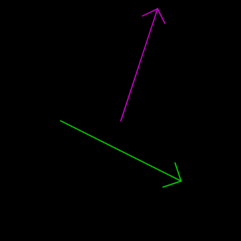

## Um pouco de ângulos, com seno, cosseno e arco tangente

### `sin()`, `cos()` e `atan2()`

As funções trigonométricas não são nenhum bicho de sete cabeças, 2π cabeças, no máximo...

Para começar é preciso saber que quando elas pedem um ângulo como argumento. elas esperam que você informe esse ângulo em *radianos*, se você pensa em graus, é só usar `radians(angulo_em_graus)` para converter. Algumas como `atan2()` devolvem um ângulo em radianos, que pode ser convertido em graus com `degrees(angulo_em_radianos)`se você precisar.

### Seno e cosseno

Para além da origem dessas funções nas relações matemáticas dos ângulos de um triângulo e de um círculo de raio unitário, das coisas mais úteis que você pode entender facilmente é que essas funções devolvem valores entre **-1** e **1** de maneira cíclica, periódica.

Vamos visualizar aqui em dois exemplos o que isso significa.

#### `sin()` e `cos()` no espaço


```python
def setup():
    size(628, 200)  # malandrangem 2π×100, 200 
    background(0)
    translate(0, 100) # desloca o Y meia tela
    indicacoes()  # desenha textos e linha em π
    strokeWeight(2)
    scale(1, -1)  # inverte o Y
    for x in range(width):
        # width ~2π×100
        a = x / 100.0
        y_cosseno = cos(a) * 100
        stroke(200, 200, 0)
        point(x, y_cosseno)
        y_seno = sin(a) * 100
        stroke(0, 200, 200)
        point(x, y_seno)

def indicacoes():
    f = createFont('FreeMono Bold', 14)
    textFont(f)
    fill(255)
    text(" 0", 0, 5)
    text("-1", 0, 98)
    text(" 1", 0, -90)
    stroke(255)
    strokeWeight(1)
    line(width / 2.0, -height / 2.0,
         width / 2.0, height / 2.0)
    text(u"π 180°", -14 + width / 2.0,
         10 - height / 2.0)
    fill(200, 200, 0)
    text("cosseno", 10, -70)
    fill(0, 200, 200)
    text("seno", 10, -50)
```

#### `sin()` e `cos()` no tempo


```python
def setup():
    size(628, 200)  # malandrangem 2π×100, 200
    f = createFont('FreeMono Bold', 14)
    textFont(f)
    
def draw():
    background(0)
    a = radians(frameCount)
    indicacoes()  # desenha textos e linha móvel
    tam_cosseno = 100 + cos(a) * 100
    fill(200, 200, 0)
    ellipse(width / 3, height / 2,
            tam_cosseno, tam_cosseno)
    tam_seno = 100 + sin(a) * 100
    fill(0, 200, 200)
    ellipse(2 * width / 3, height / 2,
            tam_seno, tam_seno)

def indicacoes():
    a = frameCount % 360 
    x = radians(a) * 100  # width ~2π×100
    stroke(255)
    line(x, 0, x, height)
    fill(255)
    noStroke()
    text(u'ângulo: {:0>3}'.format(a), 10, 20)
    fill(200, 200, 0)
    text("cosseno", 10, 40)
    fill(0, 200, 200)
    text("seno", 10, 60)
```
#### Seno e cosseno fornecem as coordenadas dos pontos em um círculo!

Dado um ângulo, usando seno e cosseno é possível calcular o X e Y dos pontos em um círculo, o que permite desenhar polígonos regulares e estrelas, por examplo. Vamos ver como isso funciona.

```python
def setup():
    global x_centro, y_centro, raio
    size(400, 400)  
    f = createFont('FreeMono Bold', 14)
    textFont(f)
    x_centro, y_centro = width / 2, height / 2
    raio = 180
    
def draw():
    background(0)
    indicacoes()  # desenha textos, círculo e linhas

    a = radians(frameCount)
    x = x_centro + raio * cos(a) 
    y = y_centro + raio * sin(a)
    
    stroke(200, 200, 0)
    line(x, y_centro, x, y)  # linha cosseno
    stroke(0, 200, 200)
    line(x_centro, y, x, y)  # linha seno
    
    strokeWeight(5)
    stroke(255)
    point(x, y)  # o ponto no círculo 

def indicacoes():
    a = frameCount % 360 
    stroke(255)
    strokeWeight(1)
    noFill()
    circle(x_centro, y_centro, raio * 2)
    line(x_centro, y_centro - raio,
         x_centro, y_centro + raio)
    line(x_centro - raio, y_centro,
         x_centro + raio, y_centro)
    fill(255)
    text(u'ângulo: {:0>3}'.format(a), 10, 20)
    fill(200, 200, 0)
    text("cosseno", 10, 40)
    fill(0, 200, 200)
    text("seno", 10, 60)
```

###  A função `atan2()`

#### Como descobrir o ângulo de um segmento de reta?

A função `atan()` (arco tangente) devolve o ângulo a partir da tangente desse ângulo, e é possível calcular a tangente dividindo o cateto oposto pelo cateto adjacente, no caso os lados paralelos aos eixos, do triângulo formado pelos pontos de uma 'linha' (como chamamos informalmente um segmento de reta definido por dois pontos). 

O cateto oposto é a diferença dos valores de Y e o adjacente a diferença dos valores de X das coordenadas da linha. Só que na prática isso é uma encrenca, se a linha ficar na vertical teremos uma divisão por zero…  Muito mais prático é entregar o trabalho de dividir para uma 'versão 2' da função do arco tangente: `atan2(dy, dx)`, os dois argumentos são as medidas dos catetos e ela cuida de tudo nos devolvendo um ângulo em radianos.

 

Note que vamos obter ângulos entre **-π** e **π** (entre **-180** e **180** graus).

#### Desenhando uma seta com `atan2()`

Para demonstrar a utilidade de se saber o ângulo de uma linha, vamos desenhar uma seta!

A estratégia é usar o ângulo para girar o sistema de coordenadas dentro da função da seta  e desenhar a cabeça de maneira mais simples.




```python
def setup():
    size(400, 400)
    strokeWeight(2)
    
def draw():
    background(0)
    stroke(200, 0, 200)
    seta(200, 200, mouseX, mouseY)
    stroke(0, 200, 0)
    seta(100, 200, 300, 300)    

def seta(xa, ya, xb, yb):
    d = dist(xa, ya, xb, yb)
    a = atan2(yb - ya, xb - xa)
    line(xa, ya, xb, yb)
    pushMatrix() 
    translate(xb, yb)
    rotate(a)
    tc = d / 10
    line(0, 0, -tc, tc)
    line(0, 0, -tc, -tc)
    popMatrix()
```

