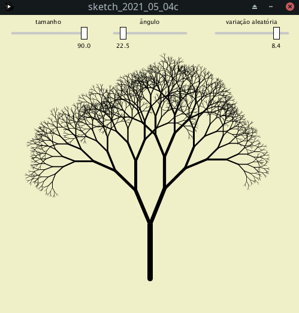

# Ideias de orientação a objetos: um slider

### Como usar uma classe `Slider`

```python
from __future__ import unicode_literals
from slider import Slider  # slider é o arquivo slider.py

def setup():
    global s1, s2, s3
    global seed
    seed = int(random(1000))
    print(seed)
    size(500, 500)
    s1 = Slider(0, 90, 50, 'tamanho')
    s1.position(20, 30)
    s2 = Slider(0, 180, 45, 'ângulo')
    s2.position(190, 30)
    s3 = Slider(0, 10, 0, 'variação aleatória')
    s3.position(360, 30)    
                
def draw():
    global angulo, rndvar
    randomSeed(seed)
    background(240, 240, 200)
    translate(250, 440)    
    tamanho = s1.update()
    angulo = radians(s2.update())
    rndvar = s3.update() / 10
    galho(tamanho)   
     
def galho(tamanho):
    reducao = 0.75
    sw = tamanho / 10
    strokeWeight(sw)
    line(0, 0, 0, -tamanho)
    if tamanho > 5:
        pushMatrix()
        translate(0, -tamanho)
        rotate(angulo)
        galho(tamanho * reducao - random(-sw, sw) * rndvar)
        rotate(-angulo * 2)
        galho(tamanho * reducao - random(-sw, sw) * rndvar)
        popMatrix()
 ```
        
 
        
### Como é a classe `Slider` por dentro?       
 
Uma aba **slider** é um arquivo `slider.py`
    
Uma primeira versão da classe Slider

```python
class Slider:

    def __init__(self, low, high, default, label=''):
        self.low , self.high = low, high
        self.value = default
        self.label = label
        self.w, self.h = 120, 20
        self.position(20, 20)  # default position

    def position(self, x, y):
        self.x, self.y = x, y
        self.rectx = self.x + map(self.value, self.low, self.high, 0, self.w)

    def update(self):
        if mousePressed and dist(mouseX, mouseY, self.rectx, self.y) < self.h:
            self.rectx = mouseX
        self.rectx = constrain(self.rectx, self.x, self.x + self.w)
        self.value = map(self.rectx, self.x, self.x + self.w, self.low, self.high)
        self.display()
        return self.value
        
    def display(self):
        push()  # combina pushMatrix() and pushStyle()
        resetMatrix()
        camera()
        rectMode(CENTER)
        strokeWeight(4)
        stroke(200)
        line(self.x, self.y, self.x + self.w, self.y)
        strokeWeight(1)
        # stroke(0)
        fill(255)
        stroke(0)
        rect(self.rectx, self.y, self.w / 12, self.h)
        fill(0)
        textAlign(CENTER, CENTER)
        text("{:.1f}".format(self.value), self.rectx, self.y + self.h)
        text(self.label, self.x + self.w / 2, self.y - self.h)
        pop()  # popStyle() and popMat
```
    
    
    
    
Acrescentando alguns extras e comentários à classe Slider

```python
class Slider:

    template = "{:.1f}"  # para formatar como mostra o valor
    label_align = CENTER

    def __init__(self, low, high, default, label=''):
        """
        Slider needs range from low to high
        and and a default value. Label is optional.
        """
        self.low = low
        self.high = high
        self.value = default
        self.label = label
        self.w, self.h = 120, 20
        self.position(20, 20)  # default position

    def position(self, x, y):
        """Set position on screen, and the rectx 'handle' position"""
        self.x = x
        self.y = y
        # the position of the rect you slide:
        self.rectx = self.x + map(self.value, self.low, self.high, 0, self.w)

    def update(self):
        """Updates the slider and returns value. Calls display()"""
        # mousePressed moves slider
        if mousePressed and dist(mouseX, mouseY, self.rectx, self.y) < self.h:
            self.rectx = mouseX
        # constrain rectangle
        self.rectx = constrain(self.rectx, self.x, self.x + self.w)
        self.value = map(self.rectx,
                         self.x, self.x + self.w,
                         self.low, self.high)
        self.display()
        return self.value
        
    def display(self):
        """Display sliner on screen, using orginal Processing coordinates."""
        push()  # combines pushMatrix() and pushStyle()
        resetMatrix()
        camera()
        rectMode(CENTER)
        # gray line behind slider
        strokeWeight(4)
        stroke(200)
        line(self.x, self.y, self.x + self.w, self.y)
        # draw rectangle
        strokeWeight(1)
        stroke(0)
        fill(255)
        translate(0, 0, 1)
        rect(self.rectx, self.y, self.w / 12, self.h)
        # draw value
        fill(0)
        textSize(10)
        textAlign(CENTER, CENTER)
        text(self.template.format(self.value), self.rectx, self.y + self.h)
        # draw label
        if self.label_align == LEFT:
            textAlign(self.label_align)
            text(self.label, self.x, self.y - self.h)
        else:
            text(self.label, self.x + self.w / 2, self.y - self.h)
        pop()  # popStyle() and popMat
```
