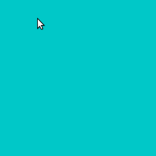

## Escutando teclas simultâneas

A questão de identificar teclas apertadas simultaneamente pode surgir quando estamos desenvolvendo um *sketch* interativo, e em especial se estamos criando um jogo, em que mais pessoas interagem simultaneamente usando o teclado, também sempre que a interface fica mais complexa e precisa de teclas em combinação. 

 Executando o código a seguir você vai notar que a variável `key` aponta para um valor que descreve a última tecla que foi pressionada (ou solta) no teclado.

Isso pode ser um problema se você precisar mostrar quando **a** e **b** estiverem apertadas simultaneamente.

 Não deixe de executar e experimentar você!

```python
def setup():
    size(256,256)
    textAlign(CENTER, CENTER)
    textSize(20)
    strokeWeight(3)
        
def draw():
    background(200, 200, 0)
    
    if key == 'a':
        fill(200, 0, 0) 
        rect(64, 96, 64, 64)
        fill(255)
        text('a', 96, 128)
        
    if key == 'b':
        fill(0, 0, 200) 
        rect(128, 96, 64, 64)
        fill(255)
        text('b', 160, 128)
        
```


Uma modificação pode evitar que uma tecla seja 'indicada' no momento em que é solta e também que fique aparecendo quando já não está mais sendo apertada, mas isso ainda não resolve o problema das teclas simultâneas: 

```python
    if keyPressed and key == 'a':
        fill(200, 0, 0) 
        rect(64, 96, 64, 64)
        fill(255)
        text('a', 96, 128)
        
    if keyPressed and key == 'b':
        fill(0, 0, 200) 
        rect(128, 96, 64, 64)
        fill(255)
        text('b', 160, 128)
```

A verdadeira solução para esta questão é criar uma estrutura que  guarde o estado das teclas, e indique se a tecla está apertada naquele momento, sendo modificada pelos eventos de apertar ou soltar uma tecla.

Num primeiro momento, para este nosso exemplo, essa estrutura pode ser simplesmente um par de variáveis globais, usadas como indicadores (*flags*) do estado das teclas. 

```python

a_apertada = False
b_apertada = False

def setup():
    size(256,256)
    textAlign(CENTER, CENTER)
    textSize(20)
    strokeWeight(3)
        
def draw():
    background(0, 200, 200)
    
    if a_apertada:
        fill(200, 0, 0) 
        rect(64, 96, 64, 64)
        fill(255)
        text('a', 96, 128)
        
    if b_apertada:
        fill(0, 0, 200) 
        rect(128, 96, 64, 64)
        fill(255)
        text('b', 160, 128)
        
def keyPressed():
    global a_apertada, b_apertada
    if key == 'a':
        a_apertada = True
    if key == 'b':
        b_apertada = True        

def keyReleased():
    global a_apertada, b_apertada
    if key == 'a':
        a_apertada = False
    if key == 'b':
        b_apertada = False        
```



Nas versões finais com teclado do [jogo PONG neste repositóro](../pong), usamos exatamente essa estratégia, de outra forma, e experiência de jogo ficaria muito prejudicada.

### Um desafio maior

Mas e se o número de teclas for muito grande? Temos que fazer um montão de condicionais com `if` dentro do `keyPressed()` e do `keyReleased`?


