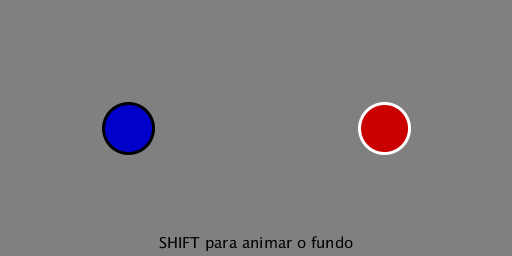

## Escutando teclas simultâneas

A questão de identificar teclas apertadas simultaneamente pode surgir quando estamos desenvolvendo um *sketch* interativo, e em especial se estamos criando um jogo, em que mais pessoas interagem simultaneamente usando o teclado, também sempre que a interface fica mais complexa e precisa de teclas em combinação. 

### Entendendo o problema

Executando o código a seguir você vai notar que a variável `key` aponta para um valor que descreve a última tecla que foi pressionada (ou solta) no teclado. Isso pode ser um problema se você precisar mostrar quando **a** e **b** estiverem apertadas simultaneamente.

 Não deixe de executar e experimentar!

```python
def setup():
    size(256,256)
    textAlign(CENTER, CENTER)
    textSize(20)
    strokeWeight(3)
        
def draw():
    background(200, 200, 0)
    
    if key == 'a':
        fill(200, 0, 0) 
        rect(64, 96, 64, 64)
        fill(255)
        text('a', 96, 128)
        
    if key == 'b':
        fill(0, 0, 200) 
        rect(128, 96, 64, 64)
        fill(255)
        text('b', 160, 128)
        
```


Uma modificação pode evitar que uma tecla seja indicada no momento em que é solta e também que fique aparecendo quando já não está mais sendo apertada, mas isso ainda não resolve o problema das teclas simultâneas: 

```python
    if keyPressed and key == 'a':
        fill(200, 0, 0) 
        rect(64, 96, 64, 64)
        fill(255)
        text('a', 96, 128)
        
    if keyPressed and key == 'b':
        fill(0, 0, 200) 
        rect(128, 96, 64, 64)
        fill(255)
        text('b', 160, 128)
```

### Uma primeira solução

As soluções para esta questão envolvem criar uma estrutura que  guarde o estado das teclas, indicando se a tecla está apertada naquele momento, e que possa ser modificada pelos eventos de apertar ou soltar uma tecla. Em um primeiro momento, para este nosso exemplo, a estrutura pode ser simplesmente um par de variáveis globais, usadas como indicadores (*flags*) do estado das teclas, `a_apertada` e `b_apertada`. 

```python

a_apertada = False
b_apertada = False

def setup():
    size(256,256)
    textAlign(CENTER, CENTER)
    textSize(20)
    strokeWeight(3)
        
def draw():
    background(0, 200, 200)
    
    if a_apertada:
        fill(200, 0, 0) 
        rect(64, 96, 64, 64)
        fill(255)
        text('a', 96, 128)
        
    if b_apertada:
        fill(0, 0, 200) 
        rect(128, 96, 64, 64)
        fill(255)
        text('b', 160, 128)
        
def keyPressed():
    global a_apertada, b_apertada
    if key == 'a':
        a_apertada = True
    if key == 'b':
        b_apertada = True        

def keyReleased():
    global a_apertada, b_apertada
    if key == 'a':
        a_apertada = False
    if key == 'b':
        b_apertada = False        
```


#### Notas

- Se você soltar uma tecla quando o *foco* do seu sistema operacional não estiver na janela do *sketch* o evento `keyReleased()` não será acionado, e o *sketch* não fica sabendo que a tecla foi solta!

- Nas versões finais com teclado do [jogo PONG neste repositóro](../pong), usamos exatamente essa estratégia, sem isso a experiência de jogo fica muito prejudicada.

### Um montão de teclas

Mas como fazer  se o número de teclas que queremos identificar for muito grande? Temos que fazer um monte variáveis globais e um monte de condicionais com `if` dentro do `keyPressed()` e do `keyReleased`? Isso não parece muito elegante!

Vamos então explorar uma estratégia de guardar as teclas que foram apertadas em uma estrutura de dados chamada **conjunto** (*set*), removendo-as do conjunto quando forem soltas. É bom notar que conjuntos não guardam a ordem em que seus itens foram adicionados, e os itens são únicos, um conjunto nunca tem itens duplicados. 

Para acrescentar um item em um conjunto usamos `conjunto.add(item)`, e para remover `conjunto.discard(item)`. Essa última operação, *discard*, não faz nada se o item não existir no conjunto.

Em Python, podemos saber se um item existe dentro de uma coleção (como listas, tuplas, deques e conjuntos) com a palavra chave `in` usada como um operador, e isso é computacionalmente muito mais eficiente em um conjunto grande do que em uma lista ou tupla grande! No exemplo abaixo, se `'b' in teclas_apertadas` for verdade, o fundo fica preto.

```python
teclas_apertadas = set()  # conjunto (set) vazio

def setup():
    size(512,256)
    textAlign(CENTER, CENTER)
    textSize(20)
    strokeWeight(3)
        
def draw():
    if 'b' in teclas_apertadas:
        background(0)
    else:
        background(100, 0, 200)
    
    for i, k in enumerate(teclas_apertadas):
        x = i * 64
        fill(0, x, 255 - i * 32) 
        rect(x, 96, 64, 64)
        fill(255)
        text(str(k), x + 32, 128)
    
def keyPressed():
    teclas_apertadas.add(key)    
    
def keyReleased():
    teclas_apertadas.discard(key)
```


Você viu um `65535` no meio das teclas?

Significa que uma tecla *codificada* (`CODED`) foi pressionada, como `SHIFT`, por exemplo. Precisamos lembrar que algumas teclas são identificadas de maneira ligeiramente diferente, as ditas teclas *codificadas*. Quando `key == CODED` você precisa usar a variável `keyCode` para saber qual tecla foi apertada (ou solta), em geral comparando com uma constante numérica destas aqui:

`UP DOWN LEFT RIGHT ALT CONTROL SHIFT`

Note que `TAB`, `ENTER` e algumas outras teclas *não codificadas* também não foram mostradas direito no exemplo anterior. Certas teclas que não são codificadas, que podem ser identificadas usando `key`, precisam ser econtradas fazendo uma comparação de `key` com constantes ou *strings* especiais:

```
BACKSPACE '\b'
TAB       '\t'
ENTER     '\n'
RETURN    '\r'
ESC       '\x1b'
DELETE    '\x7f'
```

Vamos fazer alguns ajustes no código para identificar e mostrar de maneira mais elegante essas teclas!

Para isso vamos usar outra estrutura de dados chamada **dicionário** (*dict*). Que mapeia (cria uma correspondência entre) chaves (*keys*) e valores (*values*). É muito rápido consultar um valor atrelado a uma chave em um dicionário. 

Se você sabe que a chave existe no dicionário, pode consultar com a forma `dicionario[chave]` (que dá erro se a chave não existir no dicionário). Quando não se tem certeza se a chave está lá, ou é parte da  estratégia  procurar chaves que podem não estar lá, então se usa `dicionario.get(chave, valor_se_nao_tem_a_chave)`.

```python
from __future__ import unicode_literals

teclas_apertadas = set()  # conjunto (set) vazio
# dicionário {tecla: 'nome para mostrar'}
nomes = {UP: '↑',
         DOWN: '↓',
         LEFT: '←',
         RIGHT: '→',
         ALT: 'Alt',
         CONTROL: 'Ctrl',
         SHIFT: 'Shift',
         BACKSPACE: 'Bcksp',
         TAB: 'Tab',
         ENTER: 'Enter',
         RETURN: 'Return',
         ESC: 'Esc',
         DELETE: 'Del',
         524: 'Meta',
         525: 'Menu',
         65406: 'AltGr',
         155: 'Insert',
         36: 'Home',
         35: 'End',
         33: 'PgUp',
         34: 'PgDwn',
         144: 'NumLk',
         ' ': 'espaço',
         }

def setup():
    size(512, 256)
    textAlign(CENTER, CENTER)
    textSize(15)
    strokeWeight(3)

def draw():
    # em vez de 'b' agora o espaço deixa o fundo preto
    if ' ' in teclas_apertadas:
        background(0)
    else:
        background(50, 200, 50)
    
    for i, tecla in enumerate(sorted(teclas_apertadas)):
        # tendo `tecla` no dicionário pega o 'nome para mostrar'
        n = nomes.get(tecla, tecla)  # se não tiver, devolve `tecla` mesmo!   
        x = i * 64
        fill(0, x / 2, 200)
        rect(x, 96, 64, 64)
        fill(255)
        text(n, x + 32, 128)

def keyPressed():
    if key != CODED:
        teclas_apertadas.add(key)
    else:
        teclas_apertadas.add(keyCode)

    # Impeça que o sketch seja encerrado com ESC!
    if key == ESC:
        this.key = ' '

def keyReleased():
    if key != CODED:
        teclas_apertadas.discard(key)
    else:
        teclas_apertadas.discard(keyCode)
```


#### Notas

* Uma vez que certas teclas modificam o efeito de outras, por exemplo, `SHIFT` faz a tecla `1`  aparecer como `!`, então certas sequências podem trazer resultados estranhos:

  Apertar`SHIFT`, depois `1 `, soltar `SHIFT`e por fim soltar `1`. faz o sketch ficar sem ver a tecla `!` ser 'solta'. 
  Uma solução possível é manter registro só do `keyCode` das teclas que permanece sempre o mesmo, mas podemos converter o `keyCode` , que é um número, em algo mais legível, no caso das teclas não codificadas, usando chr()`:

  ```python
  def keyPressed():
      if key != CODED:
          teclas_apertadas.add(chr(keyCode))
      else:
          teclas_apertadas.add(keyCode)

  def keyReleased():
      if key != CODED:
          teclas_apertadas.discard(chr(keyCode))
      else:
          teclas_apertadas.discard(keyCode) 
  ```
  Note que agora `a` e  `A` devem aparecer como ` A` e , `1` e `!`  como`1` . Fique atento e teste para evitar surpresas! No meu computador o `keyCode` de `+` e `-` do teclado numérico lateral, por exemplo, aparecem como `k` e `m`.
- Foi usada `sorted()` para obter uma lista ordenada a partir do conjunto `teclas_apertadas`
- Dentro do `keyPressed()` tem um pequeno truque que impede o *sketch*  de ser interrompido pela tecla `ESC`.
- No dicionário acrescentei alguns códigos de teclas que vi, estando no Linux, os códigos e nomes das teclas podem variar dependendo do seu sistema operacional.

### Combinando estratégias

A estratégia dos indicadores de estado para teclas, ou de adicionar e remover indicadores de teclas apertadas em um conjunto (*set*) usando `keyPressed()` e `keyReleased()` é boa para saber se uma tecla está apertada em um determinado momento, muito útil principalmente em controles que podem ser acionados continuamente. 

Já para alternar um ajuste, algo como ligar e desligar uma opção, por exemplo (em inglês é usado o termo *toggle*), pode ser melhor usar um indicador modificado por uma condicional simples em `keyTyped()`,`keyPressed()` ou `keyReleased()`, para evitar que um toque da tecla acione mais de uma vez a ação.

No exemplo abaixo, vamos usar um dicionário para guardar um monte de informações a respeito de dois círculos, incluindo cores, e quais teclas podem ser usadas para alterar a posição além de uma tecla para trocar a cor de contorno pela cor de preenchimento, e vice-versa.

Use `SHIFT` para ligar e desligar a animação da cor do fundo e a barra de espaço para voltar os círculos à posição inicial.

```python
teclas_apertadas = set()  # conjunto (set) vazio
pa = {'x': 128, 'y': 128,
      'fill': color(0, 0, 200), 'stroke': 0,
      'sobe': 'W', 'desce': 'S',
      'esq': 'A', 'dir': 'D',
      'inv': TAB}
pb = {'x': 384, 'y': 128,
      'fill': color(200, 0, 0), 'stroke': 255,
      'sobe': UP, 'desce': DOWN,
      'esq': LEFT, 'dir': RIGHT,
      'inv': ENTER}
players = (pa, pb)
anima_fundo = False
cor_fundo = 128

def setup():
    size(512, 256)
    textAlign(CENTER, CENTER)
    textSize(15)
    strokeWeight(3)

def draw():
    global cor_fundo
    if anima_fundo:
        cor_fundo = abs(cor_fundo + sin(frameCount / 60.)) % 256
    background(cor_fundo)
    for p in players:
        print p
        fill(p['fill'])
        stroke(p['stroke'])
        ellipse(p['x'], p['y'], 50, 50)
        # Ajusta a posição dos círculos
        if p['sobe'] in teclas_apertadas:
            p['y'] -= 1
        if p['desce'] in teclas_apertadas:
            p['y'] += 1
        if p['esq'] in teclas_apertadas:
            p['x'] -= 1
        if p['dir'] in teclas_apertadas:
            p['x'] += 1

def keyPressed():
    teclas_apertadas.add(keyCode if key == CODED else chr(keyCode))
    for p in players:
        if p['inv'] in teclas_apertadas:
            p['fill'], p['stroke'] = p['stroke'], p['fill']

def keyReleased():
    global anima_fundo
    teclas_apertadas.discard(keyCode if key == CODED else chr(keyCode))
    if keyCode == SHIFT:
        anima_fundo = not anima_fundo
    if key == ' ':
        pa['x'], pa['y'] = 128, 128
        pb['x'], pb['y'] = 384, 128
```



#### Notas

- As funções`keyTyped()` e`keyPressed()` são acionadas logo que a tecla é apertada, e são suscetíveis a repetição automática depois de um tempo da tecla mantida apertada, já `keyReleased()` é acionada só quando a tecla é solta.

**Desafios**

-  Você conseguiria adicionar um terceiro círculo ao código?
- Mudar a cor ou o tamanho dos círculos conforme as teclas que estão apertadas?
