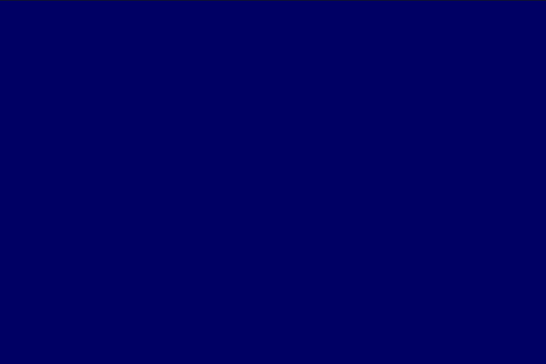

# Tipografia

## Trabalhando com fontes e outros ajustes do texto

Usamos `text("Lorem Ipsum dolor", x, y)` para escrever um texto na área de desenho. O tamanho pode ser controlado, em pontos, por `textSize()`. O alinhamento pode ser alterado por `textAlign()`. A cor vem do `fill()`.

### Exemplo básico

```pyde
"""
Adaptado do tutorial
https://py.processing.org/tutorials/typography/
"""

x, y = 33, 60

def setup():
    size(100, 100)
    textSize(12)
    textAlign(CENTER, BOTTOM) # pode ser usado LEFT, RIGHT no primeiro parâmetro e CENTER ou TOP no segundo
    noStroke()

def draw():
    global x, y
    fill(204, 120)
    rect(0, 0, width, height)
    fill(0)
    # Se o mouse estiver sobre o texto, mova!
    if (x <= mouseX <= x+55 and
        y-24 <= mouseY <= y):
        x += random(-2, 2)
        y += random(-2, 2)
    
    text(u"Cócegas", x, y)
```

## Definindo a fonte

Se não indicarmos alguma, uma fonte padrão será usada, mas podemos criar uma nova fonte (PFont) e usar em `textFont()`,
a partir de uma fonte já instalada ou de um arquivo vetorial **.ttf** ou **.otf** na pasta *"""data**:

```pyde
# para ver as fontes instaladas no seu computador
for font_name in PFont.list():
    print(font_name)
# para usar a fonte Vera Sans Mono no estilo negrito
f = createFont("Bitstream Vera Sans Mono Bold", 24)
textFont(f)
```

Especialmente no caso de não termos permissão para distribuir o arquivo vetorial da fonte, podemos criar uma fonte bitmap
a partir da original e distribuir este novo arquivo **.vlw**, na pasta *"""data**.
Usando a ferramenta **Tool > Create Font...**  produzimos o arquivo da fonte que pode ser carregado da seguinte maneira:

```pyde
font = loadFont("LetterGothicStd-32.vlw")
```

## Uma grade de letras, símbolos, glifos!


Copie o arquivo descompactado **.otf*** da fonte [Garoa Hacker Clube Bold](https://garoa.net.br/wiki/Fonte_Garoa_Hacker_Clube_Bold) na sub-pasta *"""data** do seu sketch.

```pyde
glifos = "ABCDEFGHIJKLMNOPQRSTUVWXYZ☂#$*&"
num_glifos = len(glifos)
passo = 25

def setup():
    global f
    size(640, 360)
    background(0)
    # Copie a fonte GaroaHackerClubeBold.otf na pasta /data e substitua o
    # "FreeSans Bold" abaixo
    f = createFont("FreeSans Bold", 24)
    textFont(f)
    textAlign(CENTER, CENTER)  # Alinhamento horizontal e vertical
    textSize(24)               # Tamanho do texto
    noLoop()    # Este exemplo inicialmente desliga a repetiçao do draw()...


def draw():
    background(0)
    for y in range(12, height - 12, passo):
        for x in range(12, width - 12, passo):
            sorteio = int(random(num_glifos))
            glifo = glifos[sorteio]
            if (glifo == 'A' or glifo == 'E' or glifo == 'I' or
                    glifo == 'O' or glifo == 'U'):
                fill(255, 0, 255)
            else:
                fill(0, 255, 0)

            # Desenha a letra na tela
            text(glifo, x, y)

def mousePressed():
    loop()

def mouseReleased():
    noLoop()
```
É possível desenhar texto no modo `P3D` (veja mais sobre isso na página sobre [Desenho em 3D](desenho-3D.md) )
Este exemplo mostra 23 linhas na tela, e anima a rolagem (scroll) com o giro da [rodinha do mouse](rodinha_mouse.md).

```python
zen = u"""\
The Zen of Python, by Tim Peters

Beautiful is better than ugly.
Explicit is better than implicit.
Simple is better than complex.
Complex is better than complicated.
Flat is better than nested.
Sparse is better than dense.
Readability counts.
Special cases aren't special enough to break the rules.
Although practicality beats purity.
Errors should never pass silently.
Unless explicitly silenced.
In the face of ambiguity, refuse the temptation to guess.
There should be one—and preferably only one—obvious way to do it.
Although that way may not be obvious at first unless you're Dutch.
Now is better than never.
Although never is often better than *right* now.
If the implementation is hard to explain, it's a bad idea.
If the implementation is easy to explain, it may be a good idea.
Namespaces are one honking great idea—let's do more of those!\
"""
pos = 0

def setup():
    global zen_lines
    size(900, 600, P3D)
    textFont(createFont("Inconsolata Bold", 21))
    zen_lines = ["\n"] * 22 + zen.split('\n')
    
def draw():
    translate(0, 200, -60)
    rotateX(QUARTER_PI / 2,)
    translate(0, -250)
    background(0, 0, 100)
    x, y, lh = 75, 27, 27
    shown_lines = zen_lines[pos:(pos+22)]
    for a_line in shown_lines:
        text(a_line, x, y)
        y += lh
    
def mouseWheel(e):
    global pos
    pos += e.count
 ```


## Bibliografia

REAS, C. FRY, B. Processing: a programming handbook for visual designers and artists. Cambridge, Mass: MIT Press, 2007. 
