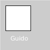

# Variáveis

Variáveis são nomes que inventamos quando estamos escrevendo um programa, e que apontam para valores na memória do computador. Esses valores podem ser simples como números inteiros (*int*/*integer*), textos (*str*/*string*) ou entidades que chamamos de *objetos*. Em Python, como vai ser possível perceber futuramente, de fato todos os valores, incluindo os números inteiros, são objetos.

### Atribuição

Para criar uma nova variável, e também para modificar o valor para o qual uma variável existente aponta, usamos o operador de atribuição `=`.

```python
lado = 50  # cria a variável `lado` que aponta para o valor 50
rect(10, 10, lado, lado)  # desenha um retângulo com 50 de largura e 50 de alt

nome = 'Guido'
text(nome, 20, 20)  # desenha o texto de `nome` na área de desenho
```


```python
a = 10  # cria a variável `a` que aponta para o valor 10
rect(a, 10, 40, 40)  # desenha um retângulo em x:10, y:10
a = a + 45  # calcula o valor de `a + 45` e faz a variável `a` apontar para o novo valor
rect(a, 10, 40, 40)  # desenha um retângulo em x:55, y:10
```
**Você consegue imaginar qual vai ser o resultado?**

<details>  
  <summary>clique para ver o resultado</summary>
  


</details>

### Metáforas para pensar sobre as variáveis

Pense nas variáveis como nomes, etiquetas que você cola nos objetos que estão na memória do computador, e você usa os nomes para pedir ao computador os valores para os quais apontam. O mesmo objeto ou valor pode ter vários apelidos, nomes que apontam pro mesmo objeto/valor na memória. 

**Modificar uma variável existente é tirar a etiqueta de um objeto e por em outro.**

```python
aluno32 = 'Alberto'
aluno_mais_antigo = aluno32
# Ambas as variáveis apontam para o mesmo texto na memória 'Alberto'
aluno_mais_antigo = 'Fernanda'
# Agora cada nome aponta para um texto diferente na memória
```
O que acontece quando atualizamos uma variável que aponta para um número somando outro número?

```python
idade = 13
idade = idade + 1  
# o computador primeiro olha para o lado direito: idade + 1, e calcula esse valor -> 14
# realiza a atribuição: idade = 14
print(idade)  # resultado: 14

# você pode escrever `idade += 1` que equivale a `idade = idade + 1` 
```

### Convenções para os nomes das variáveis

Nomear uma variável é algo a se pensar com cuidado, vamos inventar um nome que descreva os valores para os quais a variável vai apontar. Não queremos nem um nome muito longo, que dá preguiça de digitar no programa muitas vezes, nem um nome curto demais que vamos esquecer daqui alguns dias do que se trata... Veja abaixo algumas regras sintáticas do Python e recomendações estilísticas:

```python
minhaidademental = 13 # correto, mas não muito legível
minhaIdadeMental = 13  # correto, muito usado por programadores Java
minha_idade_mental = 13  # correto, muito usado por Progradores Python
d20 = 19
_idade = 42
x = 100
x_ = 200

# Funciona, mas não recomendado  
MinhaIdadeMental = 13  # Reservamos nomes com a 1ª letra maiúscula para 'classes´  

# Casos especiais
IDADE_MAXIMA = 200  # Costumamos usar só para valores que não mudam, as 'constantes'
_ = 13  # Usamos em alguns casos, quando queremos ignorar um valor

# Não funciona! Incorreto!
minha idade mental = 13 # palavras com espaços 
minha-idade-mental = 13 # palavra com hifens
2020idade_mental = 13 # não pode começar com números! idade_mental_2020 funciona.
a!idade = 13 # só letras e números e _ por favor!
```

### Assuntos relaciodados

- [Qual a diferença entre `=` (atribuição) e `==` (comparação)?](atribuicao-e-comparacao.md)
- [Escopo de variáveis](escopo_py.md)
- [Valores e seus tipos](tipagem_py.md)
