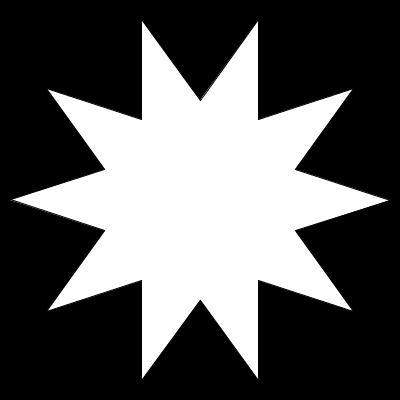
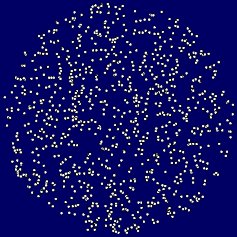
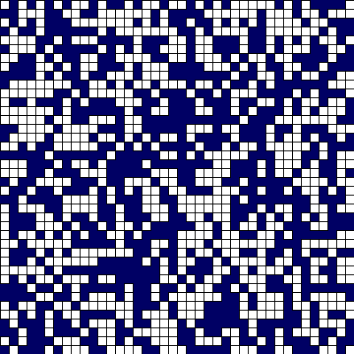

# Laço de repetição `while`

Um laço de repetição com `while` pode ser conveniente quando:

- Você precisa de contadores, ou uma sequênica de números, não-inteiros, e a forma `for i in range(inicio, parada, passo)` só funciona com inteiros. Isso pode ser resolvido implementando um [`frange()`](java_para_python.md#implementando-um-range-com-passos-não-inteiros) mas também pode ser feito com `while`

- O número de de iterações (voltas do laço) é indeterminado, isto é, não é conhecido com antecedência, você só descobre a hora de parar no meio do processo de repetições.

###### A estrutura/sintaxe dos laços `while`

De forma geral os laços de repetição baseados no `while` tem a seguinte estrutura: 

```python 
while «condição»: #  enquanto a condição for verdadeira, execute:
    «corpo» 
```

No código do corpo é necessário que seja modificada de alguma forma a condição avaliada pelo laço, para que ela se torne `False` (falsa) em determinado momento, ou então invocar `break`. Uma dessas duas coisas é necessária para evitar uma repetição infinita.

Vejamos uma descrição em abstrato de algumas dessas estratégias (que podem inclusive ser combinadas):

```python
«é criada uma variável-contador» 
while «condição que depende do contador»:
    «corpo do laço, deve incluir 
    atualização ou incremento do contador»     
```

```python
«é criada uma estrutura de dados» 
while «condição que envolve a estrutura de dados»:
    «corpo do laço, deve incluir
    modificação da estrutura de dados»      
```

```python
while True: # um laço inicialmente infinito
    «corpo do laço, deve incluir
    efeito que afeta a condição de saída»
    if «condição de saída»:
        break # saída do laço    
```

###### Um primeiro exemplo

No exemplo abaixo usaremos o laço `while` testando se o valor de um ângulo `ang` é menor que 360 graus (em radianos, a constante Pi vezes dois, ou, no Processing `TWO_PI`). 

O corpo do laço produz os vértices, que são pontos de um polígono em forma de estrela, a cada ciclo, e `ang` vai tendo o seu valor aumentado (`ang += passo`), até deixar de ser menor que `TWO_PI`, dessa forma encerrando o laço.

```python
def setup():
    size(400, 400)
    background(0)
    estrela(width / 2, height / 2, 190, 100, 10)

def estrela(x, y, raio_a, raio_b, num_pontas):
    passo = TWO_PI / num_pontas
    beginShape()
    ang = 0
    while ang < TWO_PI:  # enquanto o ângulo for menor que 2 * PI:
        sx = cos(ang) * raio_a
        sy = sin(ang) * raio_a
        vertex(x + sx, y + sy)
        sx = cos(ang + passo / 2.) * raio_b
        sy = sin(ang + passo / 2.) * raio_b
        vertex(x + sx, y + sy)
        ang += passo  # aumente o ângulo um passo
    endShape(CLOSE)
```



###### Um exemplo que adiciona tuplas sorteadas à uma lista, depenendendo de uma regra/restrição

Suponha que você quer uma coleção de 1000 pontos, descritos por tuplas (x, y), produzidos (pseudo-)aleatoriamente, mas que cumpram um requisito, no caso estar a uma certa distância do centro do desenho. A cada ciclo do laço é "sorteada" uma posição, mas ela é adicionada à lista apenas se cumprir o requisito. Como garantir que são adicionadas exatamente 1000 posições, uma vez que podem ser sorteadas posições que não atendem o requisito em alguns ciclos? A resposta é este uso de `while`.

```python
posicoes = []  # uma lista para guardar tuplas de posições

def setup():
    size(400, 400)
    background(0, 0, 100)
    while len(posicoes) < 1000:
        x = int(random(width / 5)) * 5
        y = int(random(height / 5)) * 5
        if dist(x, y, 200, 200) < 195: 
             posicoes.append((x, y))   
             circle(x, y, 5)
    print(len(posicoes))    
```


Note que neste exemplo, muito simples, não garantimos que não teremos posições sobrepostas. Isto pode ser resolvido consultando se a posição "sorteada" já existr na estrutura de dados. Para listas isso é algo não eficiente. Veja o exemplo a seguir, que resolve este problema, mas se trata de um desenho diferente, e a não-sobreposição é a única restrição.

###### Um exemplo com um conjunto - sorteando elementos que não se sobrepõe (as posições não repetem)

Imagine uma grade com 6400 posições, vocẽ quer sortear exatamente 3200 quadrados,mas não quer sobreposições.

```python
squares = set()  # conjunto, coleção que não preserva a ordem

def setup():
    size(400, 400)
    background(0, 0, 100)
    while len(squares) < 5000:
        x = int(random(width) / 5)
        y = int(random(height) / 5)
        if (x, y) not in squares:   # esta operação é rápida em conjuntos
             squares.add((x, y))    # note .add() e não .append()
             rect(x * 10, y * 10, 10, 10)
    print(len(squares))    
```



##### Um terceiro exemplo, acumulando elementos de largura variável

Neste terceiro exemplo queremos acumular retângulos de larguras aleatórias até uma determinada largura total máxima. No corpo do `while()`
há um mecanismo que checa se a adição da largura da vez passa do limite, e ajusta apropriadamente a última largura.

```python
def setup():
    size(400, 400)
    background(0)
    colorMode(HSB)
    total = 0
    while total < 400:
        largura = int(random(1, 32))
        if total + largura > 400:
            largura = 400 - total
        fill(largura * 8, 200, 200)
        rect(total, 0, largura, height)
        total += largura
        print(total)
```


