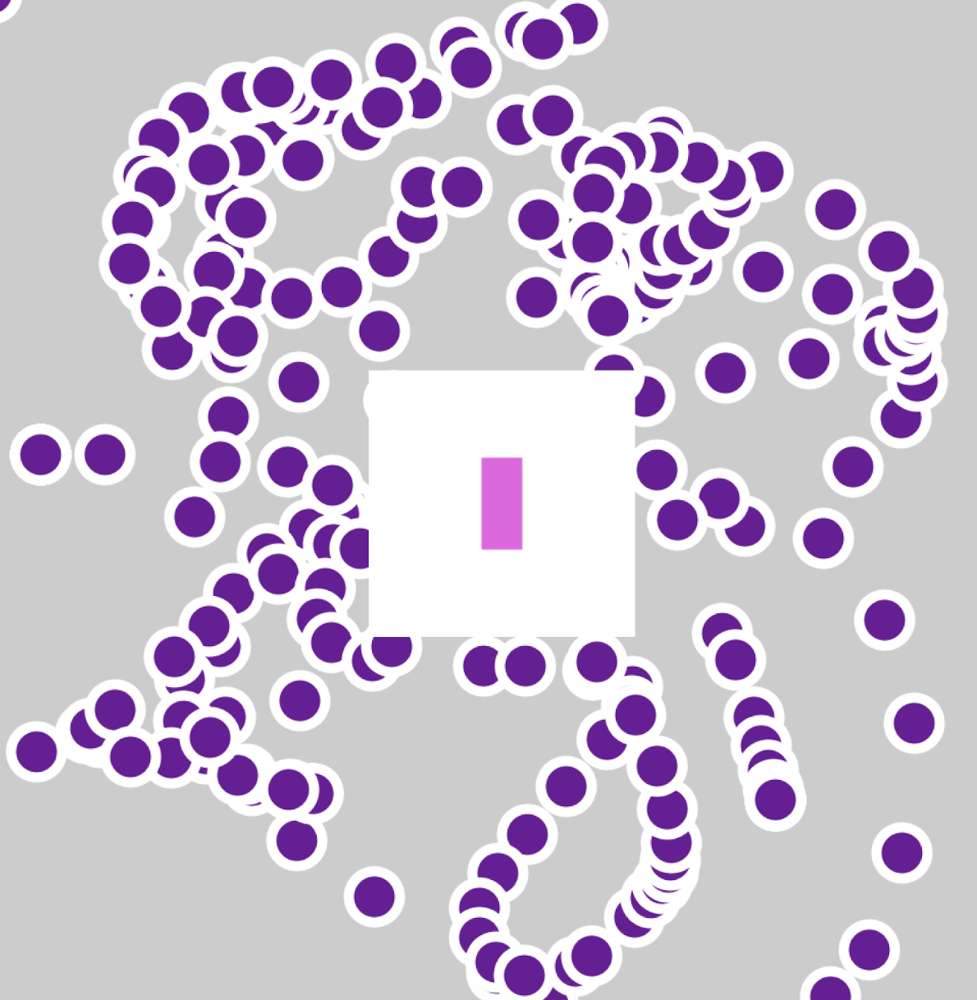

# Disciplina "Programação Criativa"

# Aula 1

```python
# define a área de desenho
size(1000, 1000)
# retângulos desenhados pelo centro
rectMode(CENTER) # CENTER em caixa alta é uma constante
# cor em RGB por padrão
fill(200, 0, 200)
stroke(255, 255, 255)
strokeWeight(10) # espessura dos traços/linhas de contorno
rect(width / 2, height / 2, 50, 100)

# para usar cor em hexa precisa estar entre aspas
fill('#651895')
# quando os numeros sao iguais (255, 255, 255)
stroke(255)
circle(100, 100, 50)

# ultimo numero é o alfa para transparente
fill(255, 255, 255, 100)
stroke(255)
# quando os numeros sao iguais
square(width / 2, height / 2, 250)

```


```python
def setup():
    size(1000, 1000)

def draw():
    rectMode(CENTER)    
    fill(200, 0, 200)  # cor em RGB
    stroke(255, 255, 255)
    strokeWeight(10)
    rect(width / 2, height / 2, 50, 100)
    
    fill('#651895')  # cor em hexa
    stroke(255)
    circle(mouseX, mouseY, 50)
    # ultimo numero é o alfa para transparente
    fill(255, 255, 255, 100)
    stroke(255)
    square(width / 2, height / 2, 250)

```



```python
def setup():
    size(1000, 1000)
    background(0)  # fundo preto

def draw():
    fill(255, 0, 255, 100)
    rectMode(CENTER)
    if mousePressed:
        circle(mouseX, mouseY, 50)

```


```python
def setup():
    size(1000, 1000)
    background(0)

def draw():
    fill(255, 0, 255, 100)
    rectMode(CENTER)
    sorteio = random(120, 179)
    if mousePressed:
        circle(mouseX, mouseY, 50)
   else :
       circle(mouseX, mouseY, 100)

```


